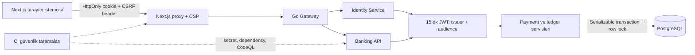

# Siber Güvenlik Kontrolleri ve Dosya Haritası

Son inceleme: **10 Eylül 2026**

Kapsam: Go API, Next.js frontend, PostgreSQL ledger, Docker ve CI/CD

[Deutsche Version](CYBER_SECURITY_DE.md)

> [!IMPORTANT]
> Bu proje bir **demo bankacılık simülasyonudur**. Aşağıdaki kontroller önemli bir güvenlik temeli sağlar; ancak uygulamayı tek başına gerçek banka, PSD2 uyumlu ödeme kuruluşu veya üretim bankacılık sistemi yapmaz. Gerçek finans ortamında SCA/MFA, HSM/KMS, merkezi fraud izleme, AML/yaptırım kontrolleri, bağımsız denetim ve mevzuat süreçleri ayrıca gerekir.

## Durum anahtarı

| Durum | Anlamı |
| --- | --- |
| ✅ Uygulandı | Kontrol kaynak kodda veya yapılandırmada mevcut ve test edilebilir. |
| 🟡 Kısmi | Temel kontrol var; gerçek banka/dağıtık üretim ortamı için güçlendirme gerekir. |
| ❌ Yok | Bu repoda uygulanmamış, üretim öncesinde ayrıca tasarlanması gereken kontrol. |

## Güvenlik mimarisi



## Hızlı kontrol özeti

| Güvenlik alanı | Durum | Başlıca dosyalar |
| --- | --- | --- |
| XSS savunması | 🟡 Kısmi | `frontend/proxy.ts`, React bileşenleri, `backend/internal/platform/email/resend.go` |
| SQL injection savunması | ✅ Uygulandı | `backend/postgres/queries/*.sql`, `backend/internal/platform/database/*.go`, `backend/sqlc.yaml` |
| JWT ve oturum | ✅ Demo seviyesi | `backend/internal/platform/identityapi/handler.go`, `backend/internal/platform/httpapi/middleware.go` |
| Parola güvenliği | ✅ Uygulandı | `backend/internal/identity/credentials.go`, `password_reset_handler.go` |
| CSRF ve CORS | ✅ Uygulandı | `backend/internal/platform/httpapi/security.go`, `backend/cmd/main.go`, `frontend/lib/api.ts` |
| BOLA/IDOR yetkilendirmesi | ✅ Uygulandı | API handler'ları, owner filtreli SQL sorguları, servis sahiplik kontrolleri |
| Finansal bütünlük | ✅ Güçlü demo kontrolü | `internal/ledger/domain/posting.go`, `internal/platform/database/ledger_repository.go`, `internal/payment/payments.go`, migration `000011` |
| Rate limiting | 🟡 Tek instance | `backend/internal/platform/httpapi/security.go`, `backend/cmd/main.go` |
| Audit kayıtları | ✅ Uygulandı | `backend/internal/platform/database/admin.go`, migration `000007` |
| Container güvenliği | ✅ Temel hardening | Backend/frontend `Dockerfile`, Compose healthcheck'leri |
| Secret ve dependency taraması | ✅ CI'da mevcut | `.github/workflows/security.yml`, `codeql.yml`, `ci.yml` |
| MFA/SCA ve işlem imzalama | ❌ Yok | Gerçek bankacılık için yeni kimlik/işlem onay servisi gerekir. |
| HSM/KMS ve anahtar rotasyonu | ❌ Yok | Deployment platformunda ayrıca kurulmalıdır. |
| Fraud/AML/yaptırım izleme | ❌ Yok | Ayrı risk ve uyum servisleri gerekir. |

## 1. XSS güvenliği

### Uygulanan kontroller

| Kontrol | Dosya | Açıklama |
| --- | --- | --- |
| Nonce tabanlı Content Security Policy | `frontend/proxy.ts` | Her istekte rastgele nonce üretir; production script politikasında `script-src 'self'`, nonce ve `strict-dynamic` kullanılır. |
| Clickjacking engeli | `frontend/proxy.ts`, `frontend/next.config.ts` | `frame-ancestors 'none'` ve `X-Frame-Options: DENY` gönderilir. |
| Tehlikeli object/embed engeli | `frontend/proxy.ts` | `object-src 'none'` uygulanır. |
| Form ve base URI sınırı | `frontend/proxy.ts` | `form-action 'self'` ve `base-uri 'self'` açık yönlendirme/enjeksiyon etkisini sınırlar. |
| React varsayılan escaping | `frontend/components/**/*.tsx` | Kullanıcı verileri JSX metni olarak render edilir. İncelemede `dangerouslySetInnerHTML`, `innerHTML`, `eval` veya `document.write` sink'i bulunmadı. |
| İzole Notification servisi | `backend/cmd/notification-service/main.go`, `backend/internal/platform/notificationapi/handler.go`, `backend/internal/platform/rabbitmq/` | Servis Banking tablolarına erişmez; minimum 32 karakterlik bearer token, strict JSON, 64 KiB limit, correlation ID ve bounded timeout kullanır. Yalnızca kendi `notification.processed_events` event-ID tablosuna yazar. |
| İzole Identity servisi | `backend/cmd/identity-service/main.go`, `backend/internal/platform/identityapi/`, `backend/internal/platform/identitystore/` | Kayıt, parola hash'i, giriş ve reset token'ları yalnız `identity` şemasında tutulur. Banking servisinin Identity tablosuna sorgu yolu yoktur; yeni müşteri yalnız ayrı token'lı özel provision komutuyla oluşturulur. |
| Gateway sınırı ve telemetry gizliliği | `backend/internal/platform/gateway/`, `backend/internal/platform/observability/` | Gateway 1 MiB body limiti ve güvenlik başlıkları uygular, özel servis token'ını browser'dan gelen isteklerden siler. Trace/log verileri parola, JWT, reset token, IBAN, bakiye veya e-posta payload'ı taşımaz. |
| Veritabanı servis sahipliği | `docker-compose.yml`, `docker/postgres/provision-service-roles.sh`, migration `000015` | `banking_app`, `identity_app` ve `notification_app` yalnız kendi şemalarında DML yetkisine sahiptir. Uygulama container'ları PostgreSQL yönetici kullanıcısını kullanmaz; çapraz şema sorgu/yazma veritabanı katmanında reddedilir. |
| Transactional outbox ve RabbitMQ | `backend/internal/platform/outbox/`, `backend/internal/platform/rabbitmq/`, `backend/postgres/migrations/000013_add_transactional_outbox.up.sql` | Ödeme/defter transaction’ı event’i outbox’a commit eder; broker publish commit sonrasıdır. Persistent mesajlar/publisher confirm, retry kuyruğu, DLQ ve idempotent consumer dual-write ve duplicate riskini azaltır; exactly-once iddia edilmez. |
| E-posta HTML escaping ve yerel yakalama | `backend/internal/platform/email/resend.go`, `backend/internal/platform/email/smtp.go`, `docker-compose.yml` | Açık komuttaki ad, hesap, tutar, karşı taraf ve açıklamalar bağlama uygun escape edilir. Lokal mesajlar MailHog SMTP ile yakalanır; üretimde Resend HTTPS kullanılabilir. |
| MIME sniffing engeli | `frontend/next.config.ts`, `backend/internal/platform/httpapi/security.go` | `X-Content-Type-Options: nosniff` gönderilir. |
| Referrer kısıtlaması | `frontend/next.config.ts`, `backend/internal/platform/httpapi/security.go` | API `no-referrer`, frontend `strict-origin-when-cross-origin` uygular. |

### Bilinen sınırlar

- `frontend/proxy.ts` içindeki `style-src 'unsafe-inline'` stil enjeksiyonuna karşı CSP'yi zayıflatır. Uzun vadede nonce/hash tabanlı stil politikası tercih edilmelidir.
- Development modunda Next.js için `unsafe-eval` açıktır; kod bunu production politikasına eklemez.
- CSP tek başına input sanitization değildir. Yeni HTML/Markdown editörü eklenirse allowlist tabanlı sanitizer kullanılmalıdır.
- Kullanıcı girdisi bir URL, HTML, SVG veya indirme dosyasına dönüştürülürse bağlama özel output encoding ayrıca uygulanmalıdır.

## 2. SQL injection güvenliği

### Uygulanan kontroller

| Kontrol | Dosya | Açıklama |
| --- | --- | --- |
| Parametreli SQL | `backend/postgres/queries/*.sql` | SQL sorguları `$1`, `$2` ve `sqlc.arg(...)` parametreleri kullanır; kullanıcı girdisi SQL metnine birleştirilmez. |
| Tip güvenli query üretimi | `backend/sqlc.yaml`, `backend/postgres/sqlc/*.go` | sqlc, sorgular için tipli Go metotları üretir. |
| Sabit manuel sorgular | `backend/internal/platform/database/admin.go`, `backend/internal/platform/database/password_reset.go` | Manuel sorgular da placeholder parametreleriyle çalışır. |
| UUID ve enum doğrulaması | `backend/internal/platform/httpapi/handler.go`, `payments_handler.go`, migration dosyaları | Path/body UUID'leri parse edilir; rol, durum, para birimi ve ödeme state'leri DB CHECK constraint'leriyle sınırlandırılır. |
| Katı JSON | `backend/internal/platform/httpapi/payments_handler.go` | `DisallowUnknownFields`, `UseNumber` ve tek JSON değeri kontrolü type confusion/mass-assignment riskini azaltır. |
| Request body limiti | `backend/internal/platform/httpapi/security.go`, `backend/cmd/main.go` | API body boyutu 1 MiB ile sınırlandırılır. |

### Bilinen sınırlar

- Local Compose varsayılan olarak geniş yetkili `root` PostgreSQL kullanıcısını kullanır. Production'da migration sahibi ile runtime uygulama kullanıcısı ayrılmalıdır.
- PostgreSQL Row Level Security kullanılmıyor. Sahiplik API ve sorgu katmanında uygulanıyor; defense-in-depth için RLS değerlendirilebilir.
- Yeni sorgularda tablo/sütun adı gibi identifier'lar dinamik üretilecekse placeholder yeterli olmaz; sabit allowlist gerekir.

## 3. Token, JWT ve oturum güvenliği

| Kontrol | Dosya | Açıklama |
| --- | --- | --- |
| HS256 imza ve minimum secret | `backend/internal/platform/identityapi/handler.go`, `backend/internal/platform/httpapi/middleware.go` | `JWT_SECRET` zorunlu ve en az 32 karakterdir; algoritma uygulama tarafından sabitlenir. |
| Standart claim'ler ve doğrulama | `backend/internal/platform/identityapi/handler.go`, `backend/internal/platform/httpapi/middleware.go` | Identity `iss=pehlione-identity`, `aud=pehlione-banking-api`, `jti`, `iat`, `nbf`, `exp` ve `user_id` üretir; Banking imza, issuer ve audience doğrular. Token ömrü 15 dakikadır. |
| HttpOnly cookie | `backend/internal/platform/identityapi/handler.go` | Token JavaScript'e açılmaz; `HttpOnly`, `SameSite=Strict`, production HTTPS'te `Secure` kullanılır. |
| Servis sınırı | `backend/internal/platform/httpapi/security.go`, `backend/internal/platform/identitystore/` | Banking, token subject'inin kendi Customer kaydını kontrol eder ancak Identity session/credential verisini okumaz. Browser logout cookie'yi anında siler; kısa access-token ömrü çalınmış token riskini sınırlar. |
| Client state ayrımı | `frontend/lib/store/authStore.ts` | localStorage yalnız e-posta/UI hydration bilgisi taşır; JWT localStorage'a yazılmaz. Gerçek oturum `/session` ile doğrulanır. |
| SSE süresi | `backend/internal/platform/httpapi/payments_handler.go`, `backend/internal/payment/events.go` | SSE token süresinde kapanır ve kullanıcı başına bağlantıyı sınırlar. |

### Gerçek banka için gereken ek kontroller

- ❌ Phishing-resistant MFA: WebAuthn/passkey veya donanım anahtarı.
- ❌ PSD2 SCA benzeri iki bağımsız faktör ve risk tabanlı step-up authentication.
- ❌ Ödeme detaylarına bağlı dynamic linking/transaction signing; yalnız “oturum açık” olması ödeme onayı sayılmamalıdır.
- ❌ Refresh token rotation, cihaz/session listesi, tek cihaz logout ve şüpheli oturum iptali.
- ❌ HS256 shared secret yerine KMS/HSM'de tutulan, döndürülebilir asimetrik anahtarlar; `kid` ve kontrollü JWKS rotasyonu.
- ❌ Credential stuffing/bot savunması, breached-password kontrolü ve hesap ele geçirme davranış analizi.

## 4. Parola ve parola sıfırlama

| Kontrol | Dosya | Açıklama |
| --- | --- | --- |
| bcrypt hash | `backend/internal/platform/httpapi/handler.go`, `credentials.go` | Parolalar düz metin tutulmaz; bcrypt ile hashlenir. |
| Parola politikası | `backend/internal/identity/credentials.go` | Minimum 15 karakter, maksimum 72 byte ve yaygın parola engeli uygulanır. |
| Enumeration ve timing azaltma | `backend/internal/platform/identityapi/handler.go`, `backend/internal/platform/httpapi/password_reset_handler.go` | Bilinen, bilinmeyen ve geçersiz e-posta için aynı `202`/generic mesaj döner. Hesap lookup, entropy, token saklama ve e-posta bounded arka plan işindedir. |
| Kriptografik reset token | `backend/internal/platform/httpapi/password_reset_handler.go` | 32 random byte token üretilir; veritabanında token'ın hash'i tutulur. |
| Tek kullanım ve 15 dakika | `backend/internal/platform/database/password_reset.go`, migration `000009` | Token kilitlenerek tüketilir, süresi doğrulanır ve tekrar kullanım engellenir. |
| Reset sonrası session iptali | `backend/internal/platform/identitystore/store.go`, `backend/internal/platform/bankingclient/client.go`, `backend/internal/platform/httpapi/security.go` | Parola değişince Identity session generation artırılır, Banking'e private revocation command gönderilir ve eski generation taşıyan JWT reddedilir. |
| Token/payload log gizliliği | `backend/internal/platform/httpapi/password_reset_handler.go`, `backend/internal/platform/identityapi/handler.go` | Reset akışının hata loglarına raw token, e-posta veya adapter hata detayları eklenmez. |

## 5. CSRF, CORS ve HTTP güvenlik başlıkları

| Kontrol | Dosya | Açıklama |
| --- | --- | --- |
| CSRF custom header | `backend/internal/platform/httpapi/security.go`, `frontend/lib/api.ts` | Cookie-auth unsafe isteklerde `X-CSRF-Protection: 1` zorunludur. |
| Fetch Metadata | `backend/internal/platform/httpapi/security.go` | `Sec-Fetch-Site` ile cross-site/same-site unsafe istekler engellenir. |
| Origin allowlist | `backend/cmd/main.go`, `.env.example` | CORS origin'leri açık listeyle belirlenir; wildcard ve credential kombinasyonu kullanılmaz. |
| HSTS | `backend/internal/platform/httpapi/security.go`, `frontend/next.config.ts` | HTTPS yanıtlarında uzun süreli HSTS uygulanır. |
| Permissions Policy | Aynı dosyalar | Kamera, mikrofon, konum ve payment browser API'leri kapatılır. |
| JSON Content-Type | `backend/internal/platform/httpapi/security.go` | Body içeren unsafe istekler için `application/json` zorunludur. |

## 6. Yetkilendirme, BOLA ve IDOR

| Kontrol | Dosya | Açıklama |
| --- | --- | --- |
| Hesap sahipliği | `backend/internal/account/ownership.go`, `backend/internal/ledger/domain/posting.go`, `backend/internal/platform/httpapi/handler.go` | Kaynak ve hedef hesap sahipliği backend'de ve saf domain politikasında doğrulanır. Legacy `/transfers` yalnız aynı müşterinin hesapları arasında çalışır. |
| Ödeme sahipliği | `backend/internal/payment/payments.go`, `backend/postgres/queries/payments.sql` | Payment get/list/confirm/cancel işlemleri `owner_id` ile sınırlandırılır. |
| Beneficiary sahipliği | `backend/postgres/queries/payments.sql` | Listeleme, getirme ve silme owner-scoped sorgular kullanır. |
| Standing order sahipliği | `backend/postgres/queries/standing_orders.sql` | Update/cancel/list sorguları `owner_id` ile filtrelenir. |
| İşlem geçmişi | `backend/internal/platform/httpapi/handler.go`, `payments_handler.go` | Hesaba erişmeden önce authenticated user ile owner kontrolü yapılır. |
| Admin rolü | `backend/internal/platform/httpapi/admin_handler.go` | Token claim'ine kör güvenmek yerine kullanıcının güncel rolü veritabanından okunur. Self-demotion engellenir. |
| Sistem hesabı koruması | `backend/internal/ledger/domain/posting.go`, `backend/internal/payment/payments.go` | Customer akışlarının settlement/system hesaplarını doğrudan kullanması engellenir. |

Frontend route guard güvenlik sınırı değildir. `frontend/proxy.ts` kullanıcı deneyimi için cookie varlığını kontrol eder; gerçek yetkilendirme daima Go API ve PostgreSQL sorgularında yapılır.

## 7. Finansal işlem ve ledger güvenliği

| Kontrol | Dosya | Açıklama |
| --- | --- | --- |
| Exact decimal | `backend/internal/ledger/money.go` | Float yerine `decimal` kullanılır; EUR tutarı pozitif, en fazla iki ondalık ve üst sınır içinde olmalıdır. |
| Atomic double-entry | `backend/internal/ledger/domain/posting.go`, `backend/internal/platform/database/ledger_repository.go`, `backend/internal/payment/payments.go` | Dengeli debit/credit planı domain katmanında doğrulanır; girişler ve cached balance tek serializable transaction içinde yazılır. Hata halinde rollback olur. |
| Serializable isolation | `backend/internal/platform/database/store.go` | Finansal transaction'lar `sql.LevelSerializable` kullanır; serialization conflict kontrollü backoff ile tekrar denenir. |
| Stabil row locking | `backend/internal/platform/database/ledger_repository.go`, `backend/internal/payment/payments.go`, `backend/postgres/queries/accounts.sql` | Hesaplar UUID sırasıyla `FOR UPDATE` kilitlenir; eşzamanlı double-spend/deadlock riski azaltılır. |
| İdempotency | `backend/internal/payment/domain/intent.go`, `backend/internal/platform/httpapi/payments_handler.go`, `backend/internal/payment/payments.go`, migration `000005` | `Idempotency-Key` zorunludur; owner+key unique constraint ve aynı intent karşılaştırması vardır. |
| Ödeme state machine | `backend/internal/payment/domain/lifecycle.go`, `backend/postgres/queries/payments.sql`, `backend/internal/payment/payments.go` | Domain katmanı izin verilen geçişi doğrular; SQL WHERE koşulları eşzamanlı state değişimini korur. |
| Worker tekilleştirme | `payments.sql`, `standing_orders.sql` | Due işler `FOR UPDATE SKIP LOCKED` ile claim edilir; birden fazla worker'ın aynı işi alması engellenir. |
| VoP ve açık onay | `vop.go`, `payments.go`, `payments_handler.go` | Ödeme önce VoP sonucuna, sonra açık kullanıcı onayına gider; mismatch override backend tarafından kaydedilir. |
| Append-only ledger | migration `000011_make_ledger_entries_append_only.up.sql` | `entries` üzerinde UPDATE ve DELETE trigger ile engellenir; düzeltmeler ters/compensating entry olarak yapılmalıdır. |
| Reconciliation | `backend/internal/platform/database/ledger_repository.go`, `backend/postgres/queries/accounts.sql` | Cached bakiye, `SUM(credit)-SUM(debit)` ile karşılaştırılabilir. |

## 8. Audit, log ve gizlilik

| Kontrol | Dosya | Açıklama |
| --- | --- | --- |
| Admin audit | `backend/internal/platform/database/admin.go`, migration `000007` | Aktör, hedef, önce/sonra değerleri, action ve request ID aynı DB transaction'ında yazılır. |
| Append-only admin audit | migration `000007_security_hardening.up.sql` | Admin audit UPDATE/DELETE trigger ile engellenir. |
| Request correlation | `backend/cmd/main.go` | Chi RequestID loglara eklenir. |
| Hassas log azaltma | Handler ve service dosyaları | Parola/JWT/tam IBAN loglanmaz; finansal ayrıntılar yerine genel olay mesajları kullanılır. |
| IBAN maskeleme | `backend/internal/account/iban.go`, API mapper/DTO dosyaları | Liste yanıtlarında masked IBAN döndürülür; tam IBAN yalnız owner-authorized detay akışında açılır. |
| Profil PII izolasyonu | `backend/internal/platform/httpapi/profile_handler.go`, `backend/internal/platform/database/profile.go` | Profil yalnız authenticated user ID ile okunur/güncellenir; audit kaydı kişisel alan değerlerini kopyalamaz. |

Gerçek üretimde audit kayıtları ayrı güven sınırına, merkezi SIEM'e ve değiştirilemez/WORM retention katmanına gönderilmelidir. Log erişimi RBAC, alarm ve veri saklama politikasıyla yönetilmelidir.

## 9. Rate limiting ve kötüye kullanım savunması

Mevcut limitler `backend/cmd/main.go` içinde tanımlıdır:

- Global: dakikada 300 istek/IP.
- Register/login: dakikada 10 istek/IP.
- Forgot password: saatte 5 istek/IP.
- Reset password: saatte 10 istek/IP.
- VoP: dakikada 30 istek/IP.
- Payment create/confirm: dakikada 20 istek/IP.

`backend/internal/platform/httpapi/security.go` proxy header'larını yalnız açıkça güvenilen proxy modunda kabul eder.

🟡 Mevcut limiter process memory'sindedir. Çok instance'lı production ortamında Redis/API gateway tabanlı dağıtık limit, kullanıcı+cihaz+IP bileşik anahtarı, WAF, bot yönetimi ve anomali tespiti gerekir.

## 10. Container, deployment ve secret yönetimi

| Kontrol | Dosya | Açıklama |
| --- | --- | --- |
| Non-root backend | `backend/Dockerfile` | Runtime `appuser` UID 10001 ile çalışır. |
| Non-root Notification | `backend/Dockerfile.notification` | Ayrı servis `notification` UID 10002 ile çalışır; yalnızca kendi processed-event tablosuna erişir, Banking tablolarına sorgu yolu yoktur. |
| Non-root frontend | `frontend/Dockerfile` | Runtime `nextjs` UID 1001 ile çalışır. |
| Minimal runtime | Dockerfile'lar | Multi-stage build kullanılır; frontend runtime'dan npm/corepack kaldırılır. |
| Healthcheck | Dockerfile'lar, Compose dosyaları | Banking API, Notification, frontend, PostgreSQL ve RabbitMQ için sağlık kontrolleri vardır. |
| Secret'in repodan ayrılması | `.gitignore`, `.env.example` | Gerçek `.env` commit edilmez; çalışma ortamına ayrıca aktarılır. |
| Demo seed kapalı | `.env.example`, Compose dosyaları | `DEMO_SEED=false` varsayılandır; parola olmadan seed çalışmaz. |

### Production için ek gereksinimler

- Secret'lar `.env` yerine KMS/secret manager'da tutulmalı, düzenli döndürülmeli ve erişimleri audit edilmelidir.
- DB TLS doğrulaması production'da zorunlu olmalı; `sslmode=disable` yalnız local geliştirmede kullanılmalıdır.
- Runtime DB kullanıcısı schema değiştirememeli, superuser olmamalı ve yalnız gerekli tablo/sequence izinlerine sahip olmalıdır.
- Network segmentation, private DB, egress allowlist, WAF/DDoS servisi ve mTLS servis kimliği uygulanmalıdır.
- Disk/database backup encryption, point-in-time recovery ve düzenli restore testi yapılmalıdır.

## 11. CI/CD ve supply-chain güvenliği

| Kontrol | Dosya |
| --- | --- |
| Gitleaks ile secret taraması | `.github/workflows/security.yml` |
| `govulncheck` ile reachable Go vulnerability taraması | `.github/workflows/security.yml` |
| Frontend production dependency audit | `.github/workflows/security.yml` |
| CodeQL SAST | `.github/workflows/codeql.yml` |
| Race-enabled Go testleri | `.github/workflows/ci.yml` |
| TypeScript, lint ve production build | `.github/workflows/ci.yml`, `pr.yml` |
| Dependabot güncellemeleri | `.github/dependabot.yml` |
| Container build/publish | `.github/workflows/docker.yml`, `release.yml` |

🟡 Repo frontend için `yarn.lock` ve `packageManager: yarn` kullanıyor; yerel hybrid launcher kullanıcı isteği gereği `npm run dev` çalıştırıyor. Tek ve frozen lockfile kullanan package manager standardı seçilmelidir. Yerel npm kurulumu güvenlik uyarıları gösterirse CI'daki Yarn sonucu ile karşılaştırılmalı, otomatik `--force` yükseltme yapılmamalıdır.

Gerçek banka için ayrıca SBOM üretimi, artifact provenance/attestation, imzalı container, protected environment, iki kişi onaylı release, immutable artifact promotion ve düzenli third-party dependency risk değerlendirmesi gerekir.

## 12. Güvenlik regresyon testleri

| Test alanı | Dosya |
| --- | --- |
| Güvenlik header, CSRF, rate limit, strict JSON, session revoke | `backend/internal/platform/httpapi/security_test.go` |
| JWT yapılandırması | `backend/internal/platform/httpapi/middleware_test.go` |
| Parola politikası | `backend/internal/identity/credentials_test.go` |
| BOLA/hesap CRUD | `backend/internal/platform/httpapi/handler_test.go` |
| Atomic ledger, blocked/system account ve same-owner transfer | `backend/internal/ledger/ledger_test.go` |
| Tutar sınırları | `backend/internal/ledger/money_test.go` |
| Payment idempotency/state/race | `backend/internal/payment/payments_test.go` |
| Worker/standing order | service testleri ve SQL claim sorguları |
| IBAN MOD-97 | `backend/internal/account/iban_test.go` |
| Password reset tek kullanım | `backend/internal/platform/database/password_reset_test.go` |
| Ledger UPDATE/DELETE yasağı | `backend/internal/platform/database/ledger_immutability_test.go` |
| Profil persistence ve PII içermeyen audit | `backend/internal/platform/database/profile_test.go`, `backend/internal/platform/httpapi/profile_handler_test.go` |

Temel doğrulama komutları:

```powershell
cd backend
go test -count=1 -race ./...
go vet ./...

cd ../frontend
yarn install --frozen-lockfile
yarn type-check
yarn lint
yarn build
```

## 13. Gerçek banka seviyesi önceliklendirme

### P0 — Gerçek müşteri veya para öncesi zorunlu

1. SCA/MFA ve ödeme detaylarına bağlı transaction signing.
2. HSM/KMS tabanlı anahtar yönetimi, rotasyon ve ayrılmış signing servisi.
3. Dağıtık rate limit, WAF/DDoS, bot ve credential-stuffing koruması.
4. Least-privilege DB rolleri, production TLS/mTLS ve network segmentation.
5. Fraud, AML, yaptırım taraması, limit ve vaka yönetimi.
6. Merkezi SIEM, immutable audit, 7/24 alarm ve incident response.
7. Bağımsız pentest, threat model ve ilgili mevzuat/denetim onayı.

### P1 — Üretim dayanıklılığı

1. Device-bound/rotating session modeli ve müşteri session yönetimi.
2. RLS veya eşdeğer veri katmanı tenant izolasyonu.
3. Idempotent external provider webhook'ları, imza doğrulaması ve replay koruması.
4. Backup/PITR, disaster recovery ve düzenli kaos/failover testleri.
5. SBOM, imzalı artifact, provenance ve iki kişi onaylı release.

### P2 — Sürekli iyileştirme

1. CSP'den `style-src 'unsafe-inline'` kaldırılması.
2. Merkezi policy-as-code ve otomatik güvenlik regresyonları.
3. Periyodik access review, secret rotation ve dependency risk review.
4. MASVS uyumlu mobil istemci güvenliği, mobil uygulama eklendiğinde.

## 14. Kontrol değiştirirken bakılacak dosyalar

| İhtiyaç | İlk bakılacak dosyalar |
| --- | --- |
| JWT/token değişikliği | `backend/internal/platform/httpapi/middleware.go`, `security.go`, `admin.go` |
| Login/parola/MFA | `credentials.go`, `handler.go`, `password_reset_handler.go` |
| XSS/CSP/header | `frontend/proxy.ts`, `frontend/next.config.ts`, `backend/internal/platform/httpapi/security.go` |
| SQL ve owner filtresi | `backend/postgres/queries/*.sql`, `backend/internal/platform/database/*.go` |
| Para transferi | `backend/internal/ledger/domain/posting.go`, `backend/internal/platform/database/ledger_repository.go`, `backend/internal/payment/payments.go`, `backend/internal/ledger/money.go` |
| Ödeme state/idempotency | `backend/internal/payment/domain/lifecycle.go`, `backend/internal/payment/domain/intent.go`, `backend/internal/payment/payments.go`, `backend/postgres/queries/payments.sql`, migration `000005` |
| Scheduler/worker | `payment_worker.go`, `standing_orders.go`, ilgili SQL sorguları |
| Admin ve audit | `admin_handler.go`, `db/admin.go`, migration `000007` |
| Müşteri profili/adres | `profile_handler.go`, `db/profile.go`, migration `000012`, frontend `BankingApp.tsx` |
| Ledger değiştirilemezliği | migration `000011`, `ledger_immutability_test.go` |
| Docker/secret/deployment | Dockerfile'lar, Compose dosyaları, `.env.example` |
| CI güvenlik kapısı | `.github/workflows/*.yml`, `.github/dependabot.yml` |

## İlgili belgeler

- `SECURITY.md` — güvenlik politikası ve bildirim süreci.
- `SECURITY_PENTEST_REPORT.md` — gerçekleştirilen pentest, bulgular ve yeniden test sonuçları.
- `README.md` — mimari, çalıştırma ve deployment açıklamaları.
- `pentest.md` — pentest kapsamı ve metodoloji talimatları.
