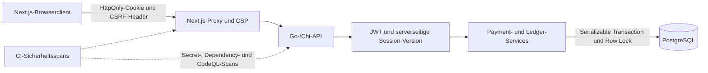

# Cybersicherheitskontrollen und Dateizuordnung

Letzte Prüfung: **10. September 2026**

Umfang: Go-API, Next.js-Frontend, PostgreSQL-Ledger, Docker und CI/CD

[Türkçe sürüm](CYBER_SECURITY.md)

> [!IMPORTANT]
> Dieses Projekt ist eine **Demo-Banking-Simulation**. Die beschriebenen Kontrollen bilden eine wichtige Sicherheitsgrundlage, machen die Anwendung allein jedoch weder zu einer echten Bank noch zu einem PSD2-konformen Zahlungsdienst oder produktionsreifen Kernbankensystem. Für reale Finanzsysteme sind unter anderem SCA/MFA, HSM/KMS, zentrale Betrugsprävention, AML-/Sanktionsprüfungen, unabhängige Audits und regulatorische Prozesse erforderlich.

## Statuslegende

| Status             | Bedeutung                                                                                           |
| ------------------ | --------------------------------------------------------------------------------------------------- |
| ✅ Umgesetzt       | Die Kontrolle ist im Quellcode oder in der Konfiguration vorhanden und prüfbar.                    |
| 🟡 Teilweise       | Eine Basiskontrolle existiert, muss aber für verteilte produktive Bankumgebungen erweitert werden. |
| ❌ Nicht vorhanden | In diesem Repository nicht implementiert und vor einem Produktivbetrieb zusätzlich zu entwerfen.   |

## Sicherheitsarchitektur



## Kurzübersicht

| Sicherheitsbereich               | Status                   | Zentrale Dateien                                                                               |
| -------------------------------- | ------------------------ | ---------------------------------------------------------------------------------------------- |
| XSS-Schutz                       | 🟡 Teilweise             | `frontend/proxy.ts`, React-Komponenten, `backend/internal/platform/email/resend.go`                 |
| Schutz vor SQL Injection         | ✅ Umgesetzt             | `backend/postgres/queries/*.sql`, `backend/internal/platform/database/*.go`, `backend/sqlc.yaml`        |
| JWT und Sessions                 | ✅ Demo-Niveau           | `backend/internal/platform/httpapi/middleware.go`, `backend/internal/platform/httpapi/security.go`                   |
| Passwortsicherheit               | ✅ Umgesetzt             | `backend/internal/identity/credentials.go`, `password_reset_handler.go`                                 |
| CSRF und CORS                    | ✅ Umgesetzt             | `backend/internal/platform/httpapi/security.go`, `backend/cmd/main.go`, `frontend/lib/api.ts`         |
| BOLA-/IDOR-Autorisierung         | ✅ Umgesetzt             | API-Handler, Owner-gefilterte SQL-Abfragen und Service-Prüfungen                              |
| Finanzielle Integrität          | ✅ Starke Demo-Kontrolle | `internal/ledger/domain/posting.go`, `internal/platform/database/ledger_repository.go`, `internal/payment/payments.go`, Migration `000011` |
| Rate Limiting                    | 🟡 Pro Instanz           | `backend/internal/platform/httpapi/security.go`, `backend/cmd/main.go`                                  |
| Audit-Protokolle                 | ✅ Umgesetzt             | `backend/internal/platform/database/admin.go`, Migration `000007`                                         |
| Container-Sicherheit             | ✅ Basis-Hardening       | Backend-/Frontend-`Dockerfile`, Compose-Healthchecks                                         |
| Secret- und Dependency-Scans     | ✅ In CI vorhanden       | `.github/workflows/security.yml`, `codeql.yml`, `ci.yml`                                 |
| MFA/SCA und Transaktionssignatur | ❌ Nicht vorhanden       | Für reale Bankanwendungen ist ein zusätzlicher Identitäts- und Freigabedienst erforderlich. |
| HSM/KMS und Schlüsselrotation   | ❌ Nicht vorhanden       | Muss über die Deployment-Plattform ergänzt werden.                                           |
| Fraud-/AML-/Sanktionsprüfung    | ❌ Nicht vorhanden       | Erfordert separate Risiko- und Compliance-Dienste.                                             |

## 1. XSS-Sicherheit

### Umgesetzte Kontrollen

| Kontrolle                                      | Datei                                                                                                | Beschreibung                                                                                                                                                                                                                       |
| ---------------------------------------------- | ---------------------------------------------------------------------------------------------------- | ---------------------------------------------------------------------------------------------------------------------------------------------------------------------------------------------------------------------------------- |
| Nonce-basierte Content Security Policy         | `frontend/proxy.ts`                                                                                | Erzeugt pro Request eine zufällige Nonce. Die produktive Script-Policy verwendet`script-src 'self'`, Nonce und `strict-dynamic`.                                                                                              |
| Clickjacking-Schutz                            | `frontend/proxy.ts`, `frontend/next.config.ts`                                                   | Sendet`frame-ancestors 'none'` und `X-Frame-Options: DENY`.                                                                                                                                                                    |
| Sperre gefährlicher Objekte                   | `frontend/proxy.ts`                                                                                | Setzt`object-src 'none'`.                                                                                                                                                                                                        |
| Begrenzung von Formularen und Base-URI         | `frontend/proxy.ts`                                                                                | `form-action 'self'` und `base-uri 'self'` begrenzen die Wirkung von Injection und manipulierten Basis-URLs.                                                                                                                   |
| React Standard-Escaping                        | `frontend/components/**/*.tsx`                                                                     | Benutzerdaten werden als JSX-Text gerendert. Bei der Prüfung wurden keine Verwendungen von`dangerouslySetInnerHTML`, `innerHTML`, `eval` oder `document.write` gefunden.                                                  |
| Isolierter Notification Service               | `backend/cmd/notification-service/main.go`, `backend/internal/platform/notificationapi/handler.go`, `backend/internal/platform/rabbitmq/` | Der Service liest keine Banking-Tabellen; Bearer-Token mit mindestens 32 Zeichen, striktes JSON, 64-KiB-Limit, Correlation-ID und begrenzte Timeouts schützen die private API. Er schreibt nur seine eigene Event-ID-Tabelle `notification.processed_events`. |
| Transactional Outbox und RabbitMQ | `backend/internal/platform/outbox/`, `backend/internal/platform/rabbitmq/`, `backend/postgres/migrations/000013_add_transactional_outbox.up.sql` | Die Zahlungs-/Ledger-Transaktion committet das Event in die Outbox; Broker-Publishing folgt erst danach. Persistente Nachrichten/Publisher-Confirm, Retry-Queue, DLQ und idempotente Consumer begrenzen Dual-Write- und Duplicate-Risiken; Exactly-once wird nicht behauptet. |
| HTML-Escaping und lokales Abfangen von E-Mails | `backend/internal/platform/email/resend.go`, `backend/internal/platform/email/smtp.go`, `docker-compose.yml` | Name, Konto, Betrag, Gegenpartei und Verwendungszweck aus expliziten Commands werden kontextgerecht escaped. Lokal fängt MailHog SMTP ab; Produktion kann Resend HTTPS verwenden. |
| Schutz vor MIME Sniffing                       | `frontend/next.config.ts`, `backend/internal/platform/httpapi/security.go`                                    | Sendet`X-Content-Type-Options: nosniff`.                                                                                                                                                                                         |
| Referrer-Begrenzung                            | Dieselben Dateien                                                                                    | Die API verwendet`no-referrer`, das Frontend `strict-origin-when-cross-origin`.                                                                                                                                                |

### Bekannte Grenzen

- `style-src 'unsafe-inline'` in `frontend/proxy.ts` schwächt die CSP gegenüber Style Injection. Langfristig sollte eine Nonce-/Hash-basierte Style-Policy verwendet werden.
- Im Next.js-Entwicklungsmodus ist `unsafe-eval` aktiviert; im Produktivmodus wird es nicht in die Policy aufgenommen.
- Eine CSP ersetzt keine Eingabevalidierung. Bei einem zukünftigen HTML-/Markdown-Editor ist ein Allowlist-basierter Sanitizer erforderlich.
- Werden Benutzereingaben später in URLs, HTML, SVG oder Downloads eingesetzt, ist zusätzlich kontextspezifisches Output Encoding erforderlich.

## 2. Schutz vor SQL Injection

### Umgesetzte Kontrollen

| Kontrolle                    | Datei                                                                       | Beschreibung                                                                                                                                |
| ---------------------------- | --------------------------------------------------------------------------- | ------------------------------------------------------------------------------------------------------------------------------------------- |
| Parametrisierte SQL-Abfragen | `backend/postgres/queries/*.sql`                                          | Abfragen verwenden`$1`, `$2` und `sqlc.arg(...)`; Benutzereingaben werden nicht in SQL-Strings eingefügt.                            |
| Typsichere Query-Generierung | `backend/sqlc.yaml`, `backend/postgres/sqlc/*.go`                       | sqlc erzeugt typisierte Go-Methoden für die definierten Abfragen.                                                                          |
| Feste manuelle Abfragen      | `backend/internal/platform/database/admin.go`, `backend/internal/platform/database/password_reset.go` | Auch manuelle SQL-Anweisungen verwenden Platzhalterparameter.                                                                               |
| UUID- und Enum-Validierung   | API-Handler und Migrationen                                                 | Path-/Body-UUIDs werden geparst; Rollen, Status, Währung und Payment-States werden durch DB-Constraints begrenzt.                          |
| Striktes JSON                | `backend/internal/platform/httpapi/payments_handler.go`                                | `DisallowUnknownFields`, `UseNumber` und die Prüfung auf genau einen JSON-Wert reduzieren Type-Confusion- und Mass-Assignment-Risiken. |
| Request-Body-Limit           | `backend/internal/platform/httpapi/security.go`, `backend/cmd/main.go`               | API-Request-Bodies sind auf 1 MiB begrenzt.                                                                                                 |

### Bekannte Grenzen

- Local Compose verwendet standardmäßig den weitreichend berechtigten PostgreSQL-Benutzer `root`. In Produktion müssen Migration-Owner und Runtime-Benutzer getrennt werden.
- PostgreSQL Row Level Security wird nicht verwendet. Ownership wird in API und Queries erzwungen; RLS kann zusätzliche Defense-in-Depth bieten.
- Falls künftig Tabellen- oder Spaltennamen dynamisch erzeugt werden, reichen Parameter nicht aus; hierfür ist eine feste Allowlist notwendig.

## 3. Token-, JWT- und Session-Sicherheit

| Kontrolle                                    | Datei                                                                                | Beschreibung                                                                                                                                  |
| -------------------------------------------- | ------------------------------------------------------------------------------------ | --------------------------------------------------------------------------------------------------------------------------------------------- |
| HS256-Signatur und Mindestlänge des Secrets | `backend/internal/platform/httpapi/middleware.go`                                               | `JWT_SECRET` ist verpflichtend und mindestens 32 Zeichen lang; der Algorithmus ist serverseitig festgelegt.                                 |
| Standard-Claims                              | `backend/internal/platform/httpapi/middleware.go`                                               | Erzeugt`iss`, `aud`, `jti`, `iat`, `nbf`, `exp` und `user_id`. Die Token-Laufzeit beträgt zwei Stunden.                        |
| HttpOnly-Cookie                              | `backend/internal/platform/httpapi/middleware.go`                                               | Das Token ist nicht für JavaScript sichtbar. Das Cookie verwendet`HttpOnly`, `SameSite=Strict` und bei produktivem HTTPS `Secure`.     |
| Serverseitiger Widerruf                      | `backend/internal/platform/httpapi/security.go`, `backend/internal/platform/database/admin.go`               | Die JWT-`session_version` wird mit der Datenbank verglichen. Logout sowie Passwort- oder Rollenänderungen machen ältere Tokens ungültig. |
| Trennung vom Client-State                    | `frontend/lib/store/authStore.ts`                                                  | localStorage enthält nur E-Mail-/UI-Hydration-Daten, niemals das JWT. Die tatsächliche Session wird über`/session` geprüft.             |
| SSE-Ablauf und Widerruf                      | `backend/internal/platform/httpapi/payments_handler.go`, `backend/internal/payment/events.go` | SSE endet bei Token-Ablauf, prüft die Session-Version erneut und begrenzt Verbindungen pro Benutzer.                                         |

### Zusätzliche Anforderungen für eine reale Bank

- ❌ Phishing-resistente MFA mit WebAuthn/Passkey oder Hardware-Schlüssel.
- ❌ PSD2-SCA-ähnliche unabhängige Faktoren und risikobasierte Step-up Authentication.
- ❌ Dynamic Linking bzw. Transaktionssignatur, die Betrag und Empfänger kryptografisch an die Freigabe bindet.
- ❌ Refresh-Token-Rotation, Geräte-/Session-Übersicht, Logout einzelner Geräte und Widerruf auffälliger Sessions.
- ❌ In KMS/HSM verwaltete, rotierbare asymmetrische Signaturschlüssel mit `kid` und kontrollierter JWKS-Rotation statt eines gemeinsamen HS256-Secrets.
- ❌ Schutz vor Credential Stuffing und Bots, Prüfung kompromittierter Passwörter und Account-Takeover-Erkennung.

## 4. Passwort und Passwort-Reset

| Kontrolle                        | Datei                                                           | Beschreibung                                                                                                                |
| -------------------------------- | --------------------------------------------------------------- | --------------------------------------------------------------------------------------------------------------------------- |
| bcrypt-Hash                      | `backend/internal/platform/httpapi/handler.go`, `credentials.go`         | Passwörter werden nicht im Klartext gespeichert, sondern mit bcrypt gehasht.                                               |
| Passwortrichtlinie               | `backend/internal/identity/credentials.go`                                 | Mindestens 15 Zeichen, höchstens 72 Byte und Sperre häufiger Passwörter.                                                 |
| Reduzierte Enumeration           | `handler.go`, `password_reset_handler.go`                   | Für unbekannte Benutzer wird ein Dummy-bcrypt-Vergleich ausgeführt; der Reset-Endpunkt liefert eine einheitliche Antwort. |
| Kryptografisches Reset-Token     | `password_reset_handler.go`                                   | Erzeugt 32 zufällige Byte; in der Datenbank wird nur der Hash gespeichert.                                                 |
| Einmalige Nutzung und 15 Minuten | `backend/internal/platform/database/password_reset.go`, Migration `000009` | Das Token wird gesperrt, auf Ablauf geprüft und atomar verbraucht.                                                         |
| Session-Widerruf nach Reset      | `backend/internal/platform/database/password_reset.go`                       | Bei Passwortänderung wird`session_version` erhöht.                                                                      |

## 5. CSRF, CORS und HTTP-Sicherheitsheader

| Kontrolle                       | Datei                                                         | Beschreibung                                                                                  |
| ------------------------------- | ------------------------------------------------------------- | --------------------------------------------------------------------------------------------- |
| Benutzerdefinierter CSRF-Header | `backend/internal/platform/httpapi/security.go`, `frontend/lib/api.ts` | Cookie-authentifizierte schreibende Requests benötigen`X-CSRF-Protection: 1`.              |
| Fetch Metadata                  | `backend/internal/platform/httpapi/security.go`                          | `Sec-Fetch-Site` blockiert Cross-Site- und Same-Site-Requests für unsichere HTTP-Methoden. |
| Origin-Allowlist                | `backend/cmd/main.go`, `.env.example`                     | CORS-Origins werden explizit konfiguriert; kein Credential-Wildcard.                          |
| HSTS                            | `security.go`, `frontend/next.config.ts`                  | HTTPS-Antworten erhalten eine langfristige HSTS-Policy.                                       |
| Permissions Policy              | Dieselben Dateien                                             | Kamera, Mikrofon, Standort und Payment Browser API sind deaktiviert.                          |
| JSON Content-Type               | `backend/internal/platform/httpapi/security.go`                          | Schreibende Requests mit Body benötigen`application/json`.                                 |

## 6. Autorisierung, BOLA und IDOR

| Kontrolle              | Datei                                                                               | Beschreibung                                                                                                                      |
| ---------------------- | ----------------------------------------------------------------------------------- | --------------------------------------------------------------------------------------------------------------------------------- |
| Konto-Ownership        | `backend/internal/account/ownership.go`, `backend/internal/ledger/domain/posting.go`, `backend/internal/platform/httpapi/handler.go` | Eigentümer von Quell- und Zielkonto werden im Backend und in einer reinen Domain-Regel geprüft. `/transfers` funktioniert nur zwischen Konten desselben Kunden. |
| Payment-Ownership      | `backend/internal/payment/payments.go`, `backend/postgres/queries/payments.sql` | Lesen, Listen, Bestätigen und Abbrechen werden über`owner_id` begrenzt.                                                       |
| Empfänger-Ownership   | `backend/postgres/queries/payments.sql`                                           | Listen-, Lookup- und Delete-Abfragen sind Owner-scoped.                                                                           |
| Dauerauftrag-Ownership | `backend/postgres/queries/standing_orders.sql`                                    | Update, Cancel und List filtern nach`owner_id`.                                                                                 |
| Transaktionshistorie   | API-Handler                                                                         | Vor dem Zugriff wird das Konto dem authentifizierten Benutzer zugeordnet.                                                         |
| Admin-Rolle            | `backend/internal/platform/httpapi/admin_handler.go`                                           | Die aktuelle Rolle wird aus der Datenbank gelesen und nicht blind aus dem Token übernommen. Self-Demotion wird verhindert.       |
| Systemkonten           | `backend/internal/ledger/domain/posting.go`, `backend/internal/payment/payments.go` | Kundenflüsse dürfen Settlement-/Systemkonten nicht direkt verwenden. |

Der Frontend Route Guard ist keine Sicherheitsgrenze. `frontend/proxy.ts` verbessert nur die Benutzerführung; die tatsächliche Autorisierung findet immer in Go-API und PostgreSQL-Queries statt.

## 7. Sicherheit von Zahlungen und Ledger

| Kontrolle                  | Datei                                                          | Beschreibung                                                                                                                                   |
| -------------------------- | -------------------------------------------------------------- | ---------------------------------------------------------------------------------------------------------------------------------------------- |
| Exakte Dezimalbeträge     | `backend/internal/ledger/money.go`                          | Verwendet Decimal statt Float; EUR-Beträge müssen positiv sein, höchstens zwei Nachkommastellen haben und im unterstützten Bereich liegen. |
| Atomares Double Entry      | `backend/internal/ledger/domain/posting.go`, `backend/internal/platform/database/ledger_repository.go`, `backend/internal/payment/payments.go` | Die Domain validiert ausgeglichene Debit-/Credit-Buchungen; Einträge und Cache-Balances werden in einer serialisierbaren Transaktion geschrieben. |
| Serializable Isolation     | `backend/internal/platform/database/store.go`                               | Finanzielle Transaktionen verwenden`sql.LevelSerializable`; Serialization Conflicts werden mit Backoff wiederholt.                           |
| Stabile Row Locks          | `backend/internal/platform/database/ledger_repository.go`, `backend/internal/payment/payments.go`, `backend/postgres/queries/accounts.sql` | Konten werden in UUID-Reihenfolge mit `FOR UPDATE` gesperrt, um Double Spend und Deadlocks zu reduzieren. |
| Idempotency                | `backend/internal/payment/domain/intent.go`, `backend/internal/platform/httpapi/payments_handler.go`, `backend/internal/payment/payments.go`, Migration `000005` | `Idempotency-Key` ist verpflichtend; Owner+Key ist eindeutig und derselbe Intent wird verglichen. |
| Payment State Machine      | `backend/internal/payment/domain/lifecycle.go`, `backend/postgres/queries/payments.sql`, `backend/internal/payment/payments.go` | Die Domain validiert erlaubte Übergänge; SQL-WHERE-Bedingungen schützen konkurrierende Statusänderungen. |
| Worker-Eindeutigkeit       | `payments.sql`, `standing_orders.sql`                      | Fällige Jobs werden mit`FOR UPDATE SKIP LOCKED` beansprucht.                                                                                |
| VoP und explizite Freigabe | `vop.go`, `payments.go`, `payments_handler.go`           | Payment durchläuft Empfängerprüfung und explizite Demo-Bestätigung; ein Mismatch-Override wird serverseitig gespeichert.                   |
| Append-only Ledger         | Migration`000011_make_ledger_entries_append_only.up.sql`     | UPDATE und DELETE auf`entries` werden per Trigger blockiert; Korrekturen müssen als Gegenbuchung erfolgen.                                  |
| Reconciliation             | `backend/internal/platform/database/ledger_repository.go`, `backend/postgres/queries/accounts.sql` | Die gespeicherte Balance kann mit `SUM(credit)-SUM(debit)` verglichen werden. |

## 8. Audit, Logging und Datenschutz

| Kontrolle                | Datei                                                                           | Beschreibung                                                                                                                 |
| ------------------------ | ------------------------------------------------------------------------------- | ---------------------------------------------------------------------------------------------------------------------------- |
| Admin-Audit              | `backend/internal/platform/database/admin.go`, Migration `000007`                          | Aktor, Ziel, Vorher-/Nachher-Werte, Aktion und Request-ID werden in derselben DB-Transaktion gespeichert.                    |
| Append-only Admin-Audit  | Migration`000007_security_hardening.up.sql`                                   | UPDATE und DELETE von Admin-Audit-Datensätzen werden per Trigger blockiert.                                                 |
| Request-Korrelation      | `backend/cmd/main.go`                                                         | Chi RequestID wird den Logs hinzugefügt.                                                                                    |
| Reduzierte sensible Logs | Handler- und Service-Dateien                                                    | Passwörter, JWTs und vollständige IBANs werden nicht protokolliert.                                                        |
| IBAN-Maskierung          | `backend/internal/account/iban.go`, API-Mapper/DTOs                              | Listen liefern maskierte IBANs; vollständige IBANs erscheinen nur in autorisierten Owner-Detailflüssen.                    |
| Isolation von Profil-PII | `backend/internal/platform/httpapi/profile_handler.go`, `backend/internal/platform/database/profile.go` | Profile werden nur über die authentifizierte User-ID gelesen/geändert; Audit-Daten kopieren keine persönlichen Feldwerte. |

In einer realen Produktion müssen Audit-Daten in eine getrennte Sicherheitszone, ein zentrales SIEM und einen unveränderbaren/WORM-Speicher übertragen werden. Zugriff und Aufbewahrung benötigen RBAC, Alarmierung und Retention Policies.

## 9. Rate Limiting und Missbrauchsschutz

Die aktuellen Grenzwerte stehen in `backend/cmd/main.go`:

- Global: 300 Requests pro Minute und IP.
- Registrierung/Login: 10 Requests pro Minute und IP.
- Passwort vergessen: 5 Requests pro Stunde und IP.
- Passwort zurücksetzen: 10 Requests pro Stunde und IP.
- VoP: 30 Requests pro Minute und IP.
- Payment Create/Confirm: 20 Requests pro Minute und IP.

`backend/internal/platform/httpapi/security.go` vertraut Proxy-Headern nur bei ausdrücklich aktiviertem Trusted-Proxy-Modus.

🟡 Der aktuelle Limiter lebt im Process Memory. Für mehrere Instanzen sind ein verteilter Redis-/API-Gateway-Limiter, kombinierte Benutzer-/Geräte-/IP-Schlüssel, WAF, Bot Management und Anomalieerkennung erforderlich.

## 10. Container, Deployment und Secrets

| Kontrolle                           | Datei                             | Beschreibung                                                                             |
| ----------------------------------- | --------------------------------- | ---------------------------------------------------------------------------------------- |
| Non-root Backend                    | `backend/Dockerfile`            | Runtime läuft als`appuser` mit UID 10001.                                             |
| Non-root Notification               | `backend/Dockerfile.notification` | Der separate Service läuft als `notification` mit UID 10002; er greift nur auf seine Processed-Event-Tabelle zu und hat keinen Abfrageweg zu Banking-Tabellen. |
| Non-root Frontend                   | `frontend/Dockerfile`           | Runtime läuft als`nextjs` mit UID 1001.                                               |
| Minimale Runtime                    | Dockerfiles                        | Multi-stage Builds; npm/corepack werden aus der Frontend-Runtime entfernt.               |
| Healthchecks                        | Dockerfiles und Compose-Dateien   | Banking API, Notification, Frontend, PostgreSQL und RabbitMQ besitzen Healthchecks.                 |
| Secrets außerhalb des Repositories | `.gitignore`, `.env.example`  | Die echte`.env` wird nicht committed und separat in die Laufzeitumgebung eingebracht.  |
| Demo Seed deaktiviert               | `.env.example`, Compose-Dateien | `DEMO_SEED=false` ist Standard und ohne separates Passwort wird kein Seed ausgeführt. |

### Zusätzliche Produktionsanforderungen

- Secrets gehören in KMS/Secret Manager, müssen rotiert und ihre Zugriffe auditiert werden.
- DB-TLS muss in Produktion verifiziert werden; `sslmode=disable` ist nur für lokale Entwicklung geeignet.
- Der Runtime-DB-Benutzer darf weder Schemaänderungen noch Superuser-Aktionen ausführen und erhält nur erforderliche Tabellen-/Sequence-Rechte.
- Erforderlich sind Network Segmentation, private Datenbank, Egress-Allowlist, WAF/DDoS-Dienst und gegebenenfalls mTLS-Serviceidentitäten.
- Backups benötigen Verschlüsselung, Point-in-Time Recovery und regelmäßig getestete Restores.

## 11. CI/CD- und Supply-Chain-Sicherheit

| Kontrolle                                       | Datei                                             |
| ----------------------------------------------- | ------------------------------------------------- |
| Secret Scan mit Gitleaks                        | `.github/workflows/security.yml`                |
| Reachable Go Vulnerabilities mit`govulncheck` | `.github/workflows/security.yml`                |
| Audit produktiver Frontend-Abhängigkeiten      | `.github/workflows/security.yml`                |
| CodeQL SAST                                     | `.github/workflows/codeql.yml`                  |
| Go-Tests mit Race Detector                      | `.github/workflows/ci.yml`                      |
| TypeScript, Lint und Production Build           | `.github/workflows/ci.yml`, `pr.yml`          |
| Dependabot-Updates                              | `.github/dependabot.yml`                        |
| Container Build und Veröffentlichung           | `.github/workflows/docker.yml`, `release.yml` |

🟡 Das Repository verwendet für das Frontend `yarn.lock` und `packageManager: yarn`. Der lokale Hybrid-Launcher führt auf Benutzerwunsch `npm run dev` aus. Für reproduzierbare Builds sollte ein Package Manager mit genau einem eingefrorenen Lockfile als Standard festgelegt werden. npm-Warnungen müssen mit dem Yarn-CI-Ergebnis verglichen werden; ein automatisches `npm audit fix --force` ist zu vermeiden.

Für eine echte Bank sind zusätzlich SBOM, Provenance/Attestation, signierte Container, geschützte Environments, Vier-Augen-Freigaben, immutable Artifact Promotion und regelmäßige Third-Party-Risikoprüfungen erforderlich.

## 12. Sicherheits-Regressionsprüfungen

| Testbereich                                                         | Datei                                                                                     |
| ------------------------------------------------------------------- | ----------------------------------------------------------------------------------------- |
| Security Header, CSRF, Rate Limit, Strict JSON und Session-Widerruf | `backend/internal/platform/httpapi/security_test.go`                                                 |
| JWT-Konfiguration                                                   | `backend/internal/platform/httpapi/middleware_test.go`                                               |
| Passwortrichtlinie                                                  | `backend/internal/identity/credentials_test.go`                                                      |
| BOLA und Konto-CRUD                                                 | `backend/internal/platform/httpapi/handler_test.go`                                                  |
| Atomarer Ledger, Blocked/System-Konten und Same-Owner-Transfer      | `backend/internal/ledger/ledger_test.go`                                               |
| Betragsgrenzen                                                      | `backend/internal/ledger/money_test.go`                                                |
| Payment Idempotency, State und Race                                 | `backend/internal/payment/payments_test.go`                                             |
| IBAN MOD-97                                                         | `backend/internal/account/iban_test.go`                                                    |
| Einmalige Passwort-Reset-Nutzung                                    | `backend/internal/platform/database/password_reset_test.go`                                            |
| Ledger-UPDATE-/DELETE-Sperre                                        | `backend/internal/platform/database/ledger_immutability_test.go`                                       |
| Profil-Persistenz und Audit ohne PII                                | `backend/internal/platform/database/profile_test.go`, `backend/internal/platform/httpapi/profile_handler_test.go` |

Grundlegende Prüfkommandos:

```powershell
cd backend
go test -count=1 -race ./...
go vet ./...

cd ../frontend
yarn install --frozen-lockfile
yarn type-check
yarn lint
yarn build
```

## 13. Prioritäten für echtes Bankniveau

### P0 — Vor echten Kunden oder echtem Geld zwingend

1. SCA/MFA und an die Zahlungsdaten gebundene Transaktionssignatur.
2. HSM-/KMS-basierte Schlüsselverwaltung, Rotation und getrennter Signing Service.
3. Verteiltes Rate Limiting, WAF/DDoS sowie Bot- und Credential-Stuffing-Schutz.
4. Least-Privilege-DB-Rollen, produktives TLS/mTLS und Network Segmentation.
5. Fraud Detection, AML, Sanktionsprüfung, Limits und Case Management.
6. Zentrales SIEM, unveränderbares Audit, 24/7-Alarmierung und Incident Response.
7. Unabhängiger Pentest, Threat Model und regulatorische/prüferische Freigabe.

### P1 — Produktionsresilienz

1. Device-bound/rotierende Sessions und Kunden-Sessionverwaltung.
2. RLS oder gleichwertige Isolation auf Datenebene.
3. Idempotente Provider-Webhooks mit Signaturprüfung und Replay-Schutz.
4. Backup/PITR, Disaster Recovery sowie regelmäßige Chaos-/Failover-Tests.
5. SBOM, signierte Artefakte, Provenance und Vier-Augen-Releasefreigabe.

### P2 — Kontinuierliche Verbesserung

1. Entfernung von `style-src 'unsafe-inline'` aus der CSP.
2. Zentrale Policy-as-Code und automatisierte Sicherheitsregressionen.
3. Regelmäßige Access Reviews, Secret Rotation und Dependency Risk Reviews.
4. MASVS-konforme mobile Sicherheit, sobald eine mobile App hinzukommt.

## 14. Dateizuordnung für Sicherheitsänderungen

| Anforderung               | Zuerst zu prüfende Dateien                                                                  |
| ------------------------- | -------------------------------------------------------------------------------------------- |
| JWT/Token                 | `backend/internal/platform/httpapi/middleware.go`, `security.go`, `admin.go`                        |
| Login/Passwort/MFA        | `credentials.go`, `handler.go`, `password_reset_handler.go`                            |
| XSS/CSP/Header            | `frontend/proxy.ts`, `frontend/next.config.ts`, `backend/internal/platform/httpapi/security.go`     |
| SQL und Owner-Filter      | `backend/postgres/queries/*.sql`, `backend/internal/platform/database/*.go`                             |
| Geldtransfer              | `backend/internal/ledger/domain/posting.go`, `backend/internal/platform/database/ledger_repository.go`, `backend/internal/payment/payments.go`, `backend/internal/ledger/money.go` |
| Payment State/Idempotency | `backend/internal/payment/domain/lifecycle.go`, `backend/internal/payment/domain/intent.go`, `backend/internal/payment/payments.go`, `backend/postgres/queries/payments.sql`, Migration `000005` |
| Scheduler/Worker          | `payment_worker.go`, `standing_orders.go`, zugehörige SQL-Abfragen                      |
| Admin und Audit           | `admin_handler.go`, `db/admin.go`, Migration `000007`                                  |
| Kundenprofil/Adresse      | `profile_handler.go`, `db/profile.go`, Migration `000012`, Frontend `BankingApp.tsx` |
| Ledger-Unveränderbarkeit | Migration`000011`, `ledger_immutability_test.go`                                         |
| Docker/Secrets/Deployment | Dockerfiles, Compose-Dateien,`.env.example`                                                |
| CI-Sicherheitsgate        | `.github/workflows/*.yml`, `.github/dependabot.yml`                                      |

## Zugehörige Dokumente

- `SECURITY.md` — Sicherheitsrichtlinie und Meldeprozess.
- `SECURITY_PENTEST_REPORT.md` — durchgeführter Pentest, Findings und Retest-Ergebnisse.
- `README.md` — Architektur, lokaler Start und Deployment.
- `pentest.md` — Umfang und Methodik des Pentests.
