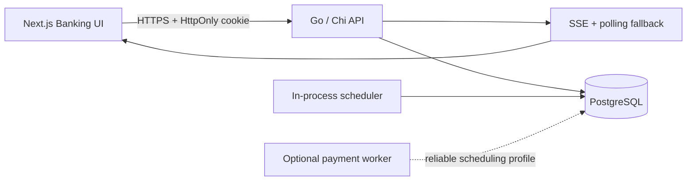

<div align="center">

# Pehlione DemoBank

### Modern SEPA banking simulation with an atomic double-entry ledger

[](https://github.com/mustafa-oezdemir/banking_go/actions/workflows/ci.yml)
[](https://github.com/mustafa-oezdemir/banking_go/actions/workflows/security.yml)
[](https://github.com/mustafa-oezdemir/banking_go/actions/workflows/codeql.yml)
[](backend/go.mod)
[](frontend/package.json)
[](docker-compose.yml)
[](LICENSE)

[Live Demo](https://pehlione-banking-frontend.onrender.com) · [API Health](https://banking-go.onrender.com/health) · [Swagger](https://banking-go.onrender.com/swagger/index.html) · [Security Report](SECURITY_PENTEST_REPORT.md)

</div>

> [!IMPORTANT]
> **Demo-Banking – kein echtes Bankkonto.** This project is a simulation. It does not connect to SEPA, PSD2, a bank, or a payment provider and never moves real money. It is not BaFin-approved or a production banking system.

## Overview

Pehlione DemoBank is a full-stack banking sandbox for exploring German IBANs, SEPA-style payment orchestration and double-entry accounting. It combines a Go API, PostgreSQL ledger and responsive German Next.js interface in one Docker- and Render-ready repository.

Every new customer receives a fictional EUR Girokonto, a valid demo IBAN and a balanced **€500 opening credit** in one database transaction.

## Highlights

| Banking experience | Payments and ledger | Platform and security |
| --- | --- | --- |
| Responsive German UI | Standard and instant transfers | HttpOnly session cookies |
| Collapsible desktop/mobile drawer | Scheduled payments | CSRF and CORS protection |
| IBAN reveal, copy and share | Standing orders | Endpoint rate limits |
| Account and transaction views | Verification of Payee | Masked IBAN responses |
| Admin user/account controls | Idempotency keys | Strict JSON validation |
| SSE updates with polling fallback | Atomic debit and credit entries | Audit events and CodeQL |

### Supported payment flows

- **Umbuchung** — between a customer's own accounts.
- **Interne Überweisung** — between Pehlione demo customers.
- **SEPA-Überweisung** — simulated external EUR transfer.
- **SEPA-Echtzeitüberweisung** — simulated instant payment.
- **Terminüberweisung** — one-time scheduled payment.
- **Dauerauftrag** — recurring scheduled payment.

The payment state machine uses `DRAFT`, `AWAITING_CONFIRMATION`, `SCHEDULED`, `PROCESSING`, `BOOKED`, `FAILED` and `CANCELLED`. External transfers balance against a system settlement account; every booked payment creates exactly one debit and one credit.

## Architecture



Money travels through the API as decimal strings, uses `decimal` in Go and is stored as PostgreSQL `NUMERIC`. Ledger writes and balance changes run inside PostgreSQL transactions with stable account locking.

## Technology

| Layer | Stack |
| --- | --- |
| Frontend | Next.js 16, React 19, TypeScript, Tailwind CSS, Zustand |
| Backend | Go 1.26, Chi Router, sqlc, JWT, zerolog |
| Database | PostgreSQL 16, additive migrations, immutable ledger entries |
| Background work | In-process scheduler or standalone Go worker |
| Delivery | Docker Compose, Render Blueprint, GitHub Actions, CodeQL |

## Quick start

### Docker Compose

Requirements: Docker Desktop with Docker Compose.

```bash
cp .env.example .env
# Replace JWT_SECRET with a unique value of at least 32 random characters.
docker compose up --build
```

| Service | Local URL |
| --- | --- |
| Banking UI | [localhost:3000](http://localhost:3000) |
| API health | [localhost:8080/health](http://localhost:8080/health) |
| Swagger UI | [localhost:8080/swagger/index.html](http://localhost:8080/swagger/index.html) |
| PostgreSQL | `localhost:5433` |

Stop the stack with `docker compose down`. Add `-v` only when you intentionally want to remove the local PostgreSQL volume.

### Optional demo data

```env
DEMO_SEED=true
DEMO_SEED_PASSWORD=<unique-secret-with-15-to-72-bytes>
```

The idempotent seed creates the fictional users `anna.beispiel@demo.invalid` and `max.mustermann@demo.invalid`, demo accounts, beneficiaries and sample payments. All names, balances and transactions are fictional.

### Optional administrator bootstrap

```env
ADMIN_SEED_EMAIL=admin@example.invalid
ADMIN_SEED_PASSWORD=<unique-secret-with-15-to-72-bytes>
```

Both values are required together. Do not commit real passwords. Public registrations always receive the `CUSTOMER` role and cannot promote themselves.

## Development

<details>
<summary><strong>Backend commands</strong></summary>

```bash
cd backend
go test -count=1 -race ./...
go vet ./...
```

Integration tests use `TEST_DB_URL`. The CI workflow starts PostgreSQL, applies every migration and then runs the race-enabled test suite.

Regenerate generated code after changing SQL queries or API annotations:

```bash
sqlc generate
go run github.com/swaggo/swag/cmd/swag@v1.16.6 init -g cmd/main.go -o docs
```

</details>

<details>
<summary><strong>Frontend commands</strong></summary>

```bash
cd frontend
corepack enable
yarn install --frozen-lockfile
yarn type-check
yarn lint
yarn build
```

</details>

## API at a glance

| Purpose | Endpoints |
| --- | --- |
| Authentication | `POST /register`, `POST /login`, `POST /logout`, `GET /session` |
| Accounts | `GET /accounts`, `GET /accounts/{id}`, `GET /accounts/{id}/transactions` |
| Payee verification | `POST /payees/verify` |
| Payments | `POST /payments`, `GET /payments`, `POST /payments/{id}/confirm`, `POST /payments/{id}/cancel` |
| Standing orders | `POST /standing-orders`, `GET /standing-orders`, `PATCH /standing-orders/{id}`, `DELETE /standing-orders/{id}` |
| Live updates | `GET /events` |
| Administration | `/admin/*` role-protected endpoints |

`POST /payments` requires an `Idempotency-Key`. Reusing a key with the same normalized intent returns the existing order; reusing it with changed payment data returns a conflict. Payment creation alone never books funds—the client must complete VoP, display the summary and explicitly confirm the payment.

## Render deployment

The repository includes a [`render.yaml`](render.yaml) Blueprint that deploys the `main` branch in Frankfurt:

- `pehlione-banking` — Go backend web service.
- `pehlione-banking-frontend` — Next.js frontend web service.
- `ledger-db` — PostgreSQL database.

1. In Render, select **New → Blueprint** and connect this repository.
2. Select `render.yaml` from `main`.
3. Configure `ADMIN_SEED_PASSWORD` if administrator bootstrap is required.
4. Keep `DEMO_SEED=false` for a clean public environment, or configure a separate `DEMO_SEED_PASSWORD`.
5. Deploy and verify `/health` before opening the frontend.

> [!NOTE]
> The free profile runs scheduled work inside the web process. Free services can sleep, so execution time is not guaranteed. For reliable scheduling, merge [`render.worker.example.yaml`](render.worker.example.yaml), disable the in-process scheduler and use a paid background worker connected to the same database.

See Render's current [free service limits](https://render.com/docs/free) and [Blueprint specification](https://render.com/docs/blueprint-spec) before production-like testing.

## Security model

- Source-account ownership is enforced by the API.
- Account and payment lists return masked IBANs.
- A full IBAN is available only through an owner-authorized account detail request.
- Cookies use Secure, HttpOnly and SameSite protections in production.
- CSRF checks, CORS allowlists and rate limits protect sensitive endpoints.
- Strict request decoding reduces mass-assignment risk.
- Stable locking and transactional writes prevent partial ledger updates.
- Logs must never contain credentials, JWTs or unmasked personal data.

Read the repository's [security pentest report](SECURITY_PENTEST_REPORT.md) for the implemented findings and mitigations.

## Project structure

```text
.
├── backend/
│   ├── cmd/                    API and worker entry points
│   ├── internal/api/           HTTP handlers and middleware
│   ├── internal/service/       Ledger, payments, seeds and scheduler
│   ├── internal/sepa/          IBAN validation and generation
│   └── postgres/               Migrations, queries and sqlc output
├── frontend/
│   ├── app/                    Next.js routes
│   ├── components/banking/     Banking UI and transfer wizard
│   └── lib/                    API client, state and types
├── docker-compose.yml
└── render.yaml
```

## Reference material

- [European Central Bank — Instant payments and Verification of Payee](https://www.ecb.europa.eu/paym/retail/instant_payments/html/instant_payments_regulation.en.html)
- [European Payments Council — SEPA Credit Transfer](https://www.europeanpaymentscouncil.eu/what-we-do/sepa-credit-transfer)
- [Deutsche Bundesbank — SEPA guidance](https://www.bundesbank.de/dynamic/action/de/aufgaben/unbarer-zahlungsverkehr/serviceangebot/sepa/613964/fragen-und-antworten-zu-sepa)

## Author and license

Created and maintained by **Mustafa Özdemir**. Licensed under the [MIT License](LICENSE).

This repository is for education and simulation only. It is not legal, compliance, financial or operational banking advice.
