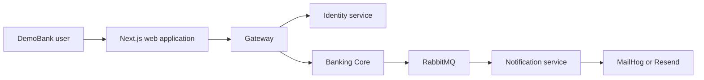
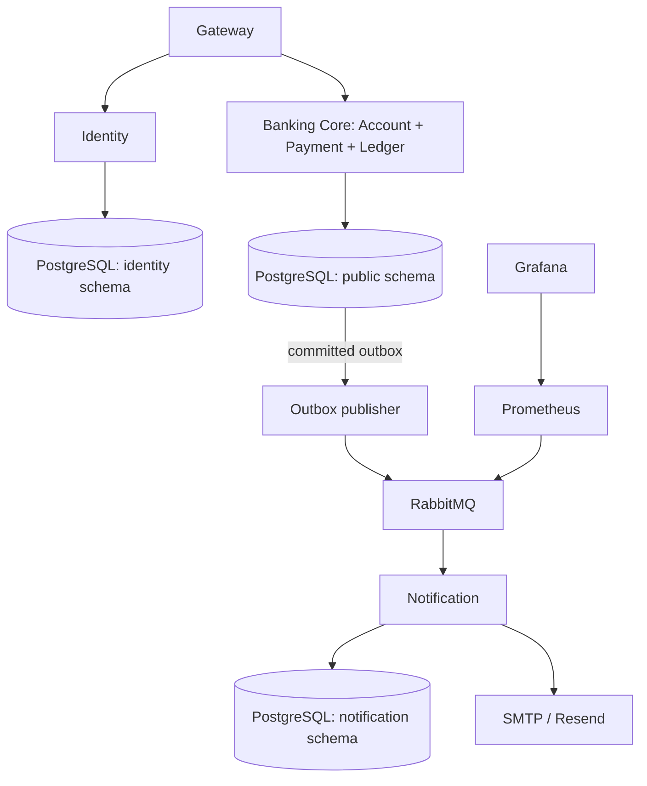
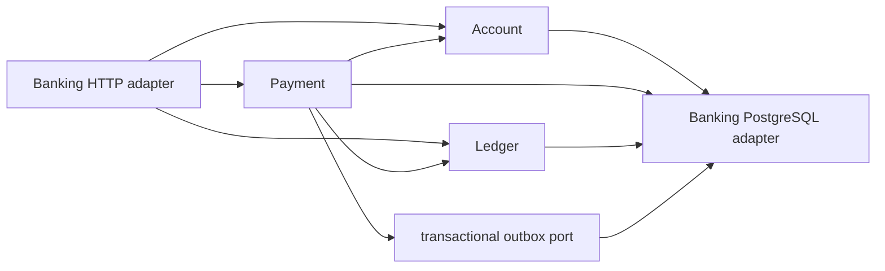

# Final service extraction decision matrix

Status: Architecture Phase 10 completed

Last verified: 2026-09-11

The system is intentionally a small distributed application, not a service-count exercise. Identity and Notification were extracted because each has an independent failure mode and owned persistence. Account, Payment and Ledger stay together because one payment booking is one financial consistency boundary.

| Candidate | Independent data ownership | Needs local financial ACID with others | Failure isolation value | Decision now | Revisit trigger |
| --- | --- | --- | --- | --- | --- |
| Identity | Yes: `identity` schema | No | High: login/reset outage must not corrupt money | Extracted | Separate database/credential rotation or external identity provider integration |
| Notification | Yes: `notification` schema/inbox | No; delivery is post-commit | High: provider/broker outages must not roll back a booking | Extracted | Higher delivery volume requiring a dedicated provider/worker deployment |
| Account | Banking `public` schema, shared with booking | Yes: ownership, locks and balances | Low alone | Retain in Banking Core | A self-contained account product with independent storage and no synchronous booking dependency |
| Payment | Banking `public` schema/outbox | Yes: lifecycle, funds checks, ledger posting | Low alone | Retain in Banking Core | A deliberately designed saga/settlement exercise with compensations and new team/service ownership |
| Ledger | Banking `public` schema | Yes: every monetary movement | Low; extraction risks correctness | Retain in Banking Core | A separate immutable accounting platform with a fully specified posting API and reconciliation migration |

## Final C4 view

### System context

### Containers and data ownership

The local Compose stack uses one PostgreSQL instance but runtime roles deny cross-schema access. That is an enforcement mechanism for the current developer topology, not a claim that services share a database contract. Cross-service business data moves only through explicit HTTP commands or versioned events.

### Banking Core components

No future event consumer may directly post ledger entries. Financial commands remain synchronous, authorized, idempotent and locally transactional at the Banking Core boundary.
