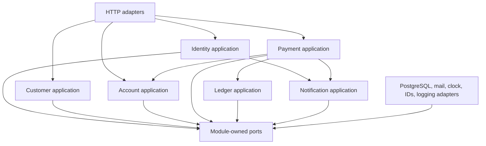
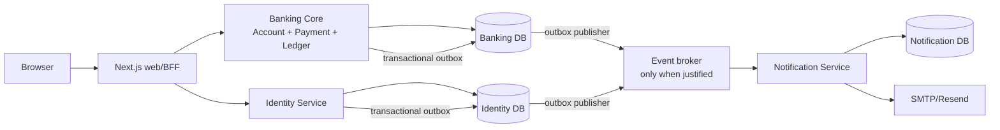

# Target Architecture

Status: Directional target; extraction is conditional

Last updated: 2026-09-10

## Objective

Evolve the existing application through a domain-oriented modular monolith into a small set of independently understandable and, only where justified, independently deployable services.

The target optimizes for learning, financial correctness, and operability by one developer. It does not optimize for service count.

## Non-goals

- No big-bang rewrite.
- No real SEPA, PSD2, core-banking, or money movement integration.
- No distributed transaction across Account, Payment, and Ledger.
- No shared database between extracted services.
- No message broker until a durable asynchronous use case exists.
- No generic shared business-model package spanning services.

## Stage 1 target: domain-oriented modular monolith

Before any extraction, the single Go backend should contain explicit business modules:

```text
backend/internal/
  identity/       authentication, credentials, sessions, reset policy
  customer/       customer profile and customer lifecycle
  account/        account ownership, status, naming and queries
  payment/        payment intent, VoP orchestration, states and schedules
  ledger/         money, entries, booking, balances and reconciliation
  notification/   notification use cases and delivery port
  platform/       PostgreSQL, HTTP, configuration, logging and providers
```

The exact package tree may differ after code-level refactoring. The important constraint is ownership and dependency direction, not folder names.



Dependencies point inward: adapters implement interfaces owned by the application/domain modules. Domain code must not import Chi, `net/http`, sqlc, `database/sql`, PostgreSQL drivers, SMTP, Resend, Docker, or a future broker.

## Logical ownership

| Module | Owns | Does not own |
| --- | --- | --- |
| Identity | Credentials, login policy, session generation/revocation, password-reset lifecycle, roles/identity authorization facts | Account balances, payment state, email transport |
| Customer | Customer profile and contact/address rules | Password verification, ledger entries |
| Account | Account identity, owner association, account type/status, IBAN assignment, account queries | Payment workflow, ledger entry creation |
| Payment | Payment intent, beneficiary/VoP decision, idempotency, payment state machine, standing orders, scheduling policy | Direct SQL, email provider, independent balance mutation |
| Ledger | Money value rules, debit/credit posting, balance checks, reconciliation, immutable financial history | HTTP DTOs, JWT, notification delivery |
| Notification | Notification intent, templates/contracts, delivery status and retry policy | Reading Identity, Account, or Ledger private tables |
| Platform | Configuration, HTTP server, PostgreSQL repositories/unit of work, provider adapters, telemetry | Business policy |

Account, Payment, and Ledger remain one deployable banking core through the modularization stages because payment booking needs one local ACID transaction.

## Dependency rules

Allowed directions:

- Transport adapters call module application services.
- Payment calls narrow Account and Ledger application ports.
- Application modules depend on their own repository, clock, ID, transaction, event, and notification ports.
- Platform adapters implement those ports.
- Composition roots may import every module solely to wire dependencies.

Forbidden directions:

- Domain packages importing transport or provider libraries.
- A module importing another module's `internal` implementation packages.
- Notification querying Identity, Account, Payment, or Ledger tables.
- Extracted services sharing sqlc models or repository implementations.
- Handlers reaching a global/concrete store to bypass application behavior.
- Asynchronous consumers mutating ledger tables outside Ledger application commands.

These rules should be guarded by Go architecture tests or a lightweight import check once the packages exist.

## Candidate deployable target

Extraction is incremental and conditional. The likely mature topology is:



This is a direction, not an immediate deployment plan. If extraction does not improve independent change, failure isolation, or learning value enough to offset operational cost, the bounded module remains in the monolith.

## Data ownership after extraction

| Service | Private data | Cross-service access |
| --- | --- | --- |
| Banking Core | Accounts, payment orders, standing orders, beneficiaries, entries, financial audit/outbox | Commands and versioned APIs/events only |
| Identity | Login identities, password hashes, session generation, roles, reset tokens | Authentication/authorization API and identity events |
| Notification | Delivery requests, deduplication keys, attempts, provider responses | Consumes versioned events; never reads another database |

Customer profile placement must be decided before Identity extraction. A practical split is authentication data in Identity and personal/customer data in Banking Core or a Customer module. The split requires an explicit migration ADR and must avoid copying unnecessary PII into events.

## Consistency model

### Strong consistency

The following stay in one Banking Core PostgreSQL transaction:

- payment state transition;
- account locks and funds check;
- debit and credit entries;
- cached balance updates;
- ledger transaction assignment;
- financial audit/outbox record.

### Eventual consistency

Email delivery, analytics, and non-authoritative UI refresh may be asynchronous. The transaction stores an outbox event; a publisher delivers it at least once; consumers deduplicate by immutable event ID.

No event handler may infer or create money movement. Financial commands remain synchronous and idempotent at the Banking Core boundary.

## Event contract principles

- Stable event ID, type, schema version, aggregate ID, occurred-at timestamp, correlation ID, and causation ID.
- Only the minimum data required by the consumer; avoid secrets and unnecessary PII.
- At-least-once delivery is assumed.
- Consumer inbox/deduplication state is stored with consumer side effects.
- Unknown event versions fail visibly or move to a dead-letter path.
- Events describe committed facts, not database row snapshots.

Example facts may include `PaymentBooked`, `PasswordResetRequested`, and `AccountStatusChanged`. Contract definitions must be versioned and tested before introducing a broker.

## Service communication and authentication

- Browser authentication terminates at the web/BFF or Identity boundary.
- Internal calls use a documented service identity mechanism only after services exist; browser JWTs are not blindly forwarded as service credentials.
- Authorization decisions that need current identity facts use a narrow API or signed, short-lived claims with explicit staleness behavior.
- Timeouts, bounded retries, and idempotency are mandatory for remote calls.
- Payment booking must not synchronously depend on Notification availability.

## Observability target

All deployables should emit structured logs and consistent metrics/traces with:

- request, correlation, and causation IDs;
- service name and version;
- payment/order IDs where safe;
- transaction retry, scheduler claim, outbox lag, consumer retry, and notification failure metrics;
- health endpoints that distinguish liveness from dependency readiness;
- no credentials, JWTs, raw reset tokens, or unnecessary personal/financial data.

OpenTelemetry may be introduced when there are multiple processes whose request flow needs correlation. It is not required merely to satisfy an architecture diagram.

## Testing target

- Pure domain tests without PostgreSQL or HTTP.
- Application tests against in-memory fakes for module-owned ports.
- Repository integration tests against migrated PostgreSQL.
- Architecture/import tests enforcing dependency rules.
- OpenAPI and event-contract compatibility tests.
- Race tests for Go modules and concurrency tests for booking/idempotency.
- End-to-end Compose smoke tests for login, account listing, payment confirmation, and reconciliation.
- Consumer duplicate-delivery tests before asynchronous extraction.

## Extraction readiness criteria

A module is ready to become a service only when:

1. Its business boundary and owner data are explicit.
2. Callers use a stable application interface rather than its store/tables.
3. It can be tested without importing another module's infrastructure.
4. Its failure mode and consistency needs are documented.
5. Its API/event contracts are versioned.
6. Data migration and rollback are rehearsed.
7. Deployment, monitoring, and on-call cost remain reasonable for one developer.

Notification is the first likely extraction because delivery is post-commit and may fail independently. Identity is a later candidate because splitting credentials, roles, and profile data introduces more authorization and data-migration complexity. Banking Core should remain a single service unless a future requirement provides a stronger reason to divide its local transaction.
