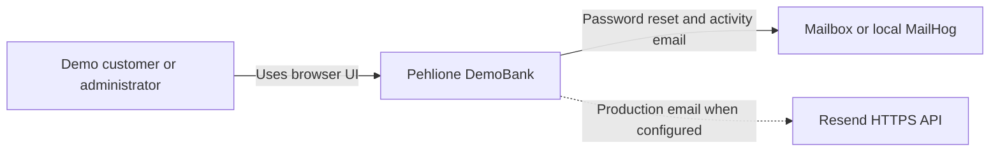
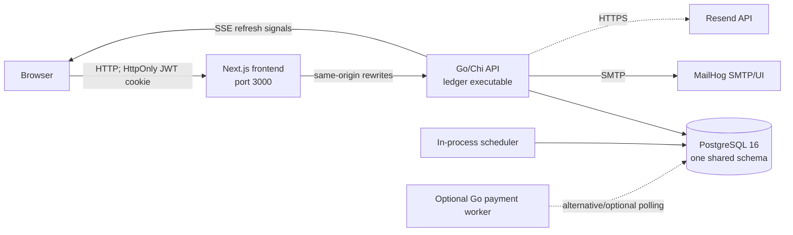
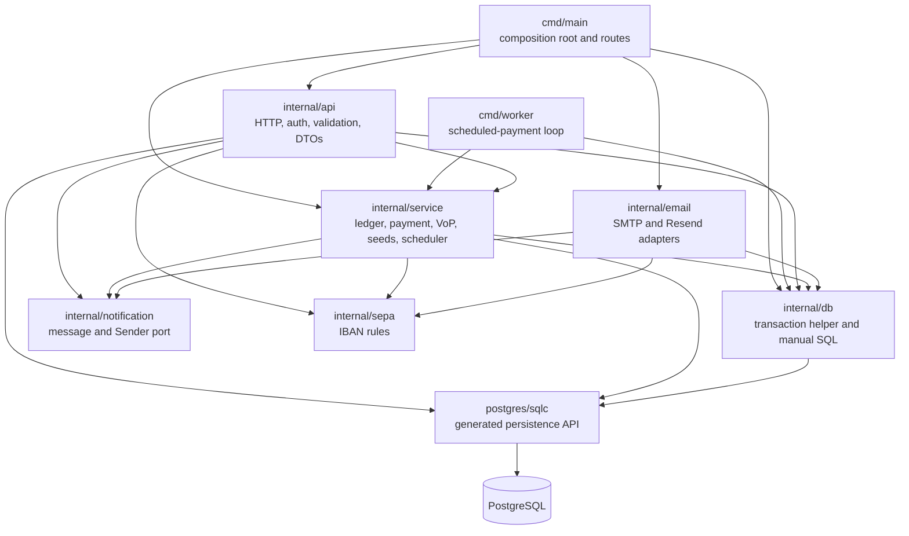

# Current Architecture

Status: Phase 0 baseline

Last verified: 2026-09-10

Scope: repository commit `4a17507`

## Purpose and system boundary

Pehlione DemoBank is a learning and portfolio application. It simulates EUR accounts, SEPA-style payments, scheduled payments, and double-entry bookkeeping. It does not connect to a bank, payment rail, or real-money provider.

The repository is a modular monolith at deployment level: a Next.js frontend and one Go banking backend share a PostgreSQL database. A second Go executable can process scheduled payments, but it uses the same code and database as the API.

## C4 level 1: system context

## C4 level 2: containers

Docker Compose starts `db`, `mailhog`, `app`, and `frontend`. The normal `app` process also runs a 30-second scheduled-payment loop unless disabled. `cmd/worker` is built into the backend image but is not a default Compose service. `docker-compose.dev.yml` adds a migration profile and a container that runs the Mage-built Linux API binary.

## C4 level 3: backend components

The arrows show compile-time dependencies. The current package names are mostly technical layers rather than business-capability boundaries.

## Executables and entry points

| Executable | Source | Responsibility |
| --- | --- | --- |
| HTTP API | `backend/cmd/main.go` | Loads environment, connects to PostgreSQL, constructs services, seeds optional demo/admin data, registers Chi routes, starts the in-process scheduler, and serves HTTP. |
| Payment worker | `backend/cmd/worker/main.go` | Connects to the same PostgreSQL schema and calls `PaymentService.RunDuePayments` every 15 seconds. |
| Linux development binary | `backend/Magefile.go` | Builds `backend/bin/linux/ledger` for `docker-compose.dev.yml`. |

The backend image additionally embeds `golang-migrate`, migrations, the API binary, and the worker binary. Its entrypoint can run migrations before the application starts.

## HTTP capabilities

| Capability | Main routes | Current implementation |
| --- | --- | --- |
| Identity/session | `/register`, `/login`, `/logout`, `/session`, `/forgot-password`, `/reset-password` | `internal/api`, `internal/db`, bcrypt, JWT middleware |
| Customer profile | `GET/PATCH /profile` | HTTP validation plus direct `db.Store` calls |
| Accounts | `/accounts`, `/accounts/{id}` | Handler-owned orchestration plus sqlc/store access |
| Ledger views | `/accounts/{id}/entries`, `/transactions/{id}`, `/accounts/{id}/reconcile` | Handler + ledger service + store |
| Own-account transfer | `POST /transfers` | `LedgerService.Transfer` |
| Payments and VoP | `/payees/verify`, `/payments*` | `PaymentService` |
| Recurring payments | `/standing-orders*` | `PaymentService` and scheduler |
| Beneficiaries | `/beneficiaries*` | Mostly direct handler/store access |
| Live refresh | `GET /events` | In-memory `EventHub` plus durable audit polling |
| Administration | `/admin/*` | Handler, store, and ledger service |

Deposit and withdrawal handler methods and frontend client functions still exist, but customer routes for `/accounts/{id}/deposit` and `/accounts/{id}/withdraw` are not registered. Balance adjustment is exposed only through the administrator route.

## Current data model and effective ownership

All capabilities share one PostgreSQL schema.

| Data | Tables | Current writers/readers |
| --- | --- | --- |
| Identity and profile | `users`, `password_reset_tokens` | API handlers, `db.Store`, seed logic, email lookup |
| Accounts | `accounts` | Account handlers, ledger, payments, admin, seeds, email |
| Ledger | `entries` | Ledger and payment services write; account/payment APIs read |
| Payments | `payment_orders`, `standing_orders`, `beneficiaries` | Payment service, payment handlers, worker, seeds |
| Audit | `audit_events`, `admin_audit_events` | Payment/profile/admin flows; SSE reads customer audit events |

There is no database ownership boundary inside the monolith. Cross-capability joins are common and intentional today, for example payment booking locks accounts and writes entries, VoP joins accounts to users, and email delivery reads users and accounts.

## Financial invariants

The following invariants are implemented and must survive future refactoring:

1. Every ledger entry has exactly one positive side: debit or credit, never both or neither.
2. A financial movement writes two equal and opposite entries with one `transaction_id`.
3. `entries` is append-only at database level; corrections require compensating entries.
4. Cached `accounts.balance` and `available_balance` are changed in the same transaction as ledger entries.
5. Reconciliation treats `SUM(credit) - SUM(debit)` as authoritative and compares it with the cached balance.
6. Customer money operations reject system accounts, inactive accounts, currency mismatches, invalid amounts, and insufficient funds.
7. Customer-facing amounts are positive EUR values with at most two decimal places and a bounded magnitude; storage uses `NUMERIC(19,4)`.
8. Account rows are locked in deterministic UUID order for two-account transfers.
9. A booked payment receives a single `ledger_transaction_id`; booking only transitions a `PROCESSING` order whose ledger ID is still null.

The database enforces entry shape, status vocabularies, unique IBANs, and append-only entries. Equal debit/credit totals across a transaction are currently enforced by application code and tests, not by a deferred database constraint.

## Transactions and consistency boundaries

`db.Store.ExecTx` uses PostgreSQL `SERIALIZABLE` transactions, retries SQLSTATE `40001` up to ten times with capped backoff, and rolls back on any callback error.

| Operation | Atomic unit |
| --- | --- |
| Registration | User, default account, opening debit/credit entries, and both cached balances |
| Deposit/withdraw | Both ledger legs and both affected balances |
| Own-account transfer | Both ledger legs and both account balances |
| Immediate payment confirmation | State transition, booking entries, balances, final payment state, and payment audit event |
| Scheduled payment processing | Claim occurs in one short transaction; each claimed payment is locked and booked or failed in its own transaction |
| Standing-order materialization | Due standing-order lock, occurrence payment creation, and schedule advancement |
| Password reset | Token lock/consumption, password change, and session-version increment |
| Profile update | Profile fields and non-PII audit marker |
| Admin role/status/balance change | Mutation and actor-aware audit record |

Some lifecycle writes are not a single atomic unit: initial payment creation and its audit insert, payment cancellation and its audit insert, and standing-order creation and its audit insert use separate transactions. A failure in the second step can return an error after the primary record has already committed.

Email delivery is post-commit by design and never participates in a financial transaction.

## Idempotency and duplicate safety

- `payment_orders` has `UNIQUE (owner_id, idempotency_key)` and `UNIQUE (end_to_end_id)`.
- A repeated key returns the existing payment only when the normalized business intent matches; changed intent returns `ErrIdempotencyConflict`.
- A concurrent create race is resolved by the database unique constraint and an intent re-read.
- Scheduled jobs claim rows with `FOR UPDATE SKIP LOCKED` and move them to `PROCESSING`.
- Stale processing rows without a ledger transaction are returned to `SCHEDULED`.
- Standing-order occurrences derive a deterministic key from standing-order ID and scheduled timestamp.
- Seed operations use unique keys, deterministic IBANs, upserts, or existence checks.

## Identity, authentication, and authorization

- Passwords use bcrypt and registration enforces a 15-to-72-byte policy.
- HS256 JWTs contain issuer, audience, user ID, JTI, issue/not-before/expiry times, and a server-side `session_version`.
- Browser tokens are stored in an HttpOnly, SameSite=Strict cookie; JavaScript stores only the display email.
- Logout and password reset increment the persisted session version, invalidating older tokens.
- Protected routes authenticate the JWT and compare its session version with PostgreSQL.
- Ownership checks exist in handlers, queries, or services depending on the flow.
- Administrator authorization re-reads the role from PostgreSQL rather than trusting a role claim.

Identity policy is currently coupled to HTTP middleware and concrete PostgreSQL access rather than exposed through an identity application interface.

## Notifications and live updates

`internal/notification` is the clearest existing port: `Sender` abstracts password-reset and activity delivery. `internal/email` implements it through SMTP or Resend.

Activity messages use a bounded in-memory channel. The enqueue is non-blocking and drops a message when full. The queue is lost on restart, has no retry persistence, and the adapter queries private `users` and `accounts` data to assemble mail. Password-reset delivery is synchronous after token persistence.

`EventHub` is an in-process, owner-scoped SSE wake-up mechanism. Durable customer event history is read from `audit_events`, but wake-up signals are instance-local. The frontend falls back to polling every 15 seconds when SSE fails.

## Frontend-to-backend communication

The browser calls relative paths with same-origin credentials. Next.js rewrites those routes to `BACKEND_API_URL`, effectively acting as a small backend-for-frontend proxy. Mutating requests add `X-CSRF-Protection: 1`. The frontend uses Zustand for session display state, validates the actual session through `/session`, and opens `/events` with cookies.

The UI is currently one large `BankingApp` client component containing overview, account, transaction, payment, profile, and admin views. There are no frontend unit or component tests in the repository; lint, TypeScript, and production build are the frontend gates.

## Tests and delivery pipeline

Backend tests cover HTTP validation and ownership, security middleware, transaction retries, profile/password-reset flows, email adapters, IBAN/VoP rules, ledger concurrency and immutability, payment idempotency/balance, scheduled work, and repeatable seeds. PostgreSQL integration tests use `TEST_DB_URL`; several tests skip when a database is unavailable.

GitHub Actions provides:

- Go lint, PostgreSQL migrations, race-enabled tests, and Linux build;
- frontend install, lint, type-check, and build;
- gitleaks, govulncheck, and production dependency audit;
- Go CodeQL analysis;
- backend/frontend image publication with provenance;
- tagged multi-platform backend release binaries.

## Architectural risks and coupling hotspots

| Risk | Evidence | Consequence |
| --- | --- | --- |
| Domain logic depends on infrastructure | `internal/service` accepts `*db.Store`, uses sqlc types, `database/sql`, and PostgreSQL errors | Business rules are difficult to test or extract without PostgreSQL. |
| HTTP layer contains application/domain behavior | Account creation, beneficiary validation, profile validation, bcrypt, and authorization orchestration live in handlers | Transport changes can affect business behavior; boundaries are unclear. |
| Concrete store is shared everywhere | API, ledger, payments, identity, admin, seed, and email use `*db.Store` | Any future service could accidentally access another capability's data. |
| Notification adapter reads banking tables | Email loads users and accounts directly | It cannot become an independent service without changing its contract and data ownership. |
| Non-durable post-commit queue | Activity notifications use an in-memory channel | Restart, saturation, or multiple instances can lose notifications. |
| Instance-local SSE | `EventHub` is process memory | Clients connected to another replica may miss immediate wake-up signals. |
| Partial lifecycle audit atomicity | Create/cancel flows sometimes audit in a second transaction | API error and persisted state can disagree. |
| Composition root owns many policies | `cmd/main.go` configures routes, security, seeding, adapters, scheduler, and infrastructure | Startup is difficult to reason about and test as the system grows. |
| Duplicate scheduler modes | API scheduler and optional worker can run together | Database claiming is safe, but configuration and operational behavior are easy to misunderstand. |
| Database-level balance invariant is incomplete | DB checks individual entries but not transaction-wide debit=credit | A future writer bypassing services could create an unbalanced transaction. |
| API contract drift risk | Routes, handwritten frontend endpoints, Swagger, and handlers are maintained separately | Dormant or missing routes can remain unnoticed without contract tests. |

## Baseline conclusion

The existing application already has strong local consistency mechanisms and several useful domain concepts. The next safe move is not service extraction. It is a domain-oriented modular monolith that places application interfaces around Identity, Customer/Account, Payment, Ledger, and Notification while keeping Account, Payment, and Ledger in one process and one serializable transaction boundary.
