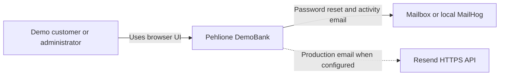
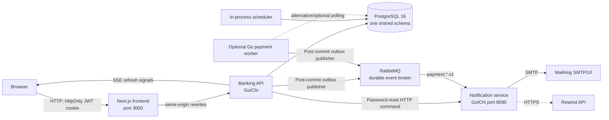

# Current Architecture

Status: Architecture Phase 4 with RabbitMQ and a transactional outbox

Last verified: 2026-09-11

Scope: Phase 4 completion state

## Purpose and system boundary

Pehlione DemoBank is a learning and portfolio application. It simulates EUR accounts, SEPA-style payments, scheduled payments, and double-entry bookkeeping. It does not connect to a bank, payment rail, or real-money provider.

The Banking Core remains a modular monolith: a Next.js frontend and one Go banking backend share PostgreSQL, with an optional worker over the same code and schema. Notification is separately deployed, owns email-provider delivery and a processed-event inbox, and never queries Banking-owned tables.

## C4 level 1: system context

## C4 level 2: containers

Docker Compose starts `postgres`, `rabbitmq`, `mailhog`, `notification-service`, `banking-api`, and `frontend`. The normal Banking API process also runs a 30-second scheduled-payment loop unless disabled. `cmd/worker` is built into the backend image but is not a default Compose service. `docker-compose.dev.yml` adds a migration profile and a container that runs the Mage-built Linux Banking API binary.

## C4 level 3: backend components

```mermaid
flowchart TB
    Main["cmd/main\ncomposition root and routes"]
    NotificationMain["cmd/notification-service\nindependent process lifecycle"]
    Worker["cmd/worker\nscheduled-payment loop"]
    HTTP["internal/platform/httpapi\nHTTP, auth, validation, DTOs"]
    Identity["internal/identity\ncredential and authentication application boundary"]
    Account["internal/account\nprofile application boundary and ownership rules"]
    Ledger["internal/ledger\nledger application service and repository port"]
    LedgerDomain["internal/ledger/domain\nposting plan and financial invariants"]
    Payment["internal/payment\npayment application service and scheduler"]
    PaymentDomain["internal/payment/domain\nlifecycle and idempotent intent"]
    Notify["internal/notification\nmessage and Sender port"]
    Bootstrap["internal/platform/bootstrap\nseed adapter"]
    NotificationClient["internal/platform/notificationclient\nBanking HTTP client and private-data mapping"]
    NotificationAPI["internal/platform/notificationapi\nprivate HTTP contract"]
    Email["internal/platform/email\nSMTP and Resend delivery"]
    Outbox["internal/platform/outbox\ntransactional event persistence/polling"]
    Rabbit["internal/platform/rabbitmq\npublisher and idempotent consumer"]
    Inbox["internal/platform/notificationstore\nprocessed event IDs"]
    DBStore["internal/platform/database\nPostgreSQL repositories and unit of work"]
    SQLC["postgres/sqlc\ngenerated persistence API"]
    PG[("PostgreSQL")]

    Main --> HTTP
    Main --> Identity
    Main --> Account
    Main --> Ledger
    Main --> Payment
    Main --> Bootstrap
    Main --> DBStore
    Main --> NotificationClient
    Main --> Outbox
    Main --> Rabbit
    NotificationMain --> NotificationAPI
    NotificationMain --> Email
    NotificationMain --> Rabbit
    NotificationMain --> Inbox
    Worker --> Payment
    Worker --> DBStore
    HTTP --> Identity
    HTTP --> Account
    HTTP --> Ledger
    HTTP --> Payment
    HTTP --> Notify
    HTTP --> DBStore
    HTTP --> SQLC
    Ledger --> Account
    Ledger --> LedgerDomain
    Payment --> Account
    Payment --> Ledger
    Payment --> LedgerDomain
    Payment --> PaymentDomain
    Payment --> Notify
    Payment --> Outbox
    Payment --> DBStore
    Payment --> SQLC
    NotificationClient --> Notify
    NotificationClient --> DBStore
    NotificationAPI --> Notify
    Bootstrap --> Identity
    Bootstrap --> Account
    Bootstrap --> Ledger
    Bootstrap --> Payment
    Bootstrap --> DBStore
    Email --> Notify
    Rabbit --> Notify
    Rabbit --> Inbox
    DBStore --> SQLC
    DBStore --> Identity
    DBStore --> Account
    DBStore --> Ledger
    DBStore --> LedgerDomain
    SQLC --> PG
```

The Banking-side Notification client remains for password reset. Payment writes fully resolved, masked account-activity payloads into the same transaction as its booking/failure state; the outbox publisher sends them only after commit. Notification persists only processed event IDs in its own schema and has no access path to Banking persistence. Architecture tests guard the service executable from Banking persistence imports as well as the Phase 2 module rules.

## Executables and entry points

| Executable | Source | Responsibility |
| --- | --- | --- |
| HTTP API | `backend/cmd/main.go` | Loads environment, connects to PostgreSQL, constructs services, seeds optional demo/admin data, registers Chi routes, starts the in-process scheduler, and serves HTTP. |
| Notification service | `backend/cmd/notification-service/main.go` | Loads provider, RabbitMQ, and Notification inbox configuration; consumes payment events idempotently, exposes health/private reset routes, and delivers through SMTP or Resend. |
| Payment worker | `backend/cmd/worker/main.go` | Connects to the same PostgreSQL schema and calls `payment.Service.RunDuePayments` every 15 seconds. |
| Linux development binaries | `backend/Magefile.go` | Builds the Banking API and standalone Notification linux/amd64 binaries. |

The backend image additionally embeds `golang-migrate`, migrations, the API binary, and the worker binary. Its entrypoint can run migrations before the application starts.

## HTTP capabilities

| Capability | Main routes | Current implementation |
| --- | --- | --- |
| Identity/session | `/register`, `/login`, `/logout`, `/session`, `/forgot-password`, `/reset-password` | Authentication application service and port plus HTTP/database adapters; reset/session middleware remains adapter-orchestrated |
| Customer profile | `GET/PATCH /profile` | `account.ProfileService` and repository port plus HTTP/database adapters |
| Accounts | `/accounts`, `/accounts/{id}` | Handler-owned orchestration plus sqlc/store access |
| Ledger views | `/accounts/{id}/entries`, `/transactions/{id}`, `/accounts/{id}/reconcile` | Handler + ledger service + store |
| Own-account transfer | `POST /transfers` | `ledger.Service.Transfer` |
| Payments and VoP | `/payees/verify`, `/payments*` | `payment.Service` |
| Recurring payments | `/standing-orders*` | `payment.Service` and scheduler |
| Beneficiaries | `/beneficiaries*` | Mostly direct handler/store access |
| Live refresh | `GET /events` | In-memory `EventHub` plus durable audit polling |
| Administration | `/admin/*` | Handler, store, and ledger service |

Deposit and withdrawal handler methods and frontend client functions still exist, but customer routes for `/accounts/{id}/deposit` and `/accounts/{id}/withdraw` are not registered. Balance adjustment is exposed only through the administrator route.

## Current data model and effective ownership

All capabilities share one PostgreSQL schema.

| Data | Tables | Current writers/readers |
| --- | --- | --- |
| Identity and profile | `users`, `password_reset_tokens` | Banking API handlers, `db.Store`, and seed logic |
| Accounts | `accounts` | Banking account handlers, ledger, payments, admin, and seeds |
| Ledger | `entries` | Ledger and payment services write; account/payment APIs read |
| Payments | `payment_orders`, `standing_orders`, `beneficiaries` | Payment service, payment handlers, worker, seeds |
| Audit | `audit_events`, `admin_audit_events` | Payment/profile/admin flows; SSE reads customer audit events |
| Outbox | `outbox_events` | Payment transaction writes; Banking API/worker publisher leases and marks publication |
| Notification inbox | `notification.processed_events` | Notification service only; event-ID claims and completed-delivery records |

There is no database ownership boundary between Banking modules. Cross-capability joins are common and intentional inside Banking, for example payment booking locks accounts and writes entries, and VoP joins accounts to users. Notification uses the shared PostgreSQL instance only for its owned `notification.processed_events` table; Banking resolves the minimum delivery payload before the asynchronous boundary.

## Financial invariants

The following invariants are implemented and must survive future refactoring:

1. Every ledger entry has exactly one positive side: debit or credit, never both or neither.
2. A financial movement writes two equal and opposite entries with one `transaction_id`.
3. `entries` is append-only at database level; corrections require compensating entries.
4. Cached `accounts.balance` and `available_balance` are changed in the same transaction as ledger entries.
5. Reconciliation treats `SUM(credit) - SUM(debit)` as authoritative and compares it with the cached balance.
6. Customer money operations reject system accounts, inactive accounts, currency mismatches, invalid amounts, and insufficient funds.
7. Customer-facing amounts are positive EUR values with at most two decimal places and a bounded magnitude; storage uses `NUMERIC(19,4)`.
8. Account rows are locked in deterministic UUID order for two-account transfers.
9. A booked payment receives a single `ledger_transaction_id`; booking only transitions a `PROCESSING` order whose ledger ID is still null.

The database enforces entry shape, status vocabularies, unique IBANs, and append-only entries. Equal debit/credit totals across a transaction are currently enforced by application code and tests, not by a deferred database constraint.

## Transactions and consistency boundaries

`db.Store.ExecTx` uses PostgreSQL `SERIALIZABLE` transactions, retries SQLSTATE `40001` up to ten times with capped backoff, and rolls back on any callback error. The ledger application accesses this behavior only through `ledger.Repository`; the payment application retains the concrete unit of work as the explicit ADR-003 exception.

| Operation | Atomic unit |
| --- | --- |
| Registration | User, default account, opening debit/credit entries, and both cached balances |
| Deposit/withdraw | Both ledger legs and both affected balances |
| Own-account transfer | Both ledger legs and both account balances |
| Immediate payment confirmation | State transition, booking entries, balances, final payment state, and payment audit event |
| Scheduled payment processing | Claim occurs in one short transaction; each claimed payment is locked and booked or failed in its own transaction |
| Standing-order materialization | Due standing-order lock, occurrence payment creation, and schedule advancement |
| Password reset | Token lock/consumption, password change, and session-version increment |
| Profile update | Profile fields and non-PII audit marker |
| Admin role/status/balance change | Mutation and actor-aware audit record |

Some lifecycle writes are not a single atomic unit: initial payment creation and its audit insert, payment cancellation and its audit insert, and standing-order creation and its audit insert use separate transactions. A failure in the second step can return an error after the primary record has already committed.

Notification delivery is post-commit by design and never participates in a financial transaction. The outbox record does participate in the financial transaction, so committed payment facts remain publishable through broker downtime.

## Idempotency and duplicate safety

- `payment_orders` has `UNIQUE (owner_id, idempotency_key)` and `UNIQUE (end_to_end_id)`.
- A repeated key returns the existing payment only when the normalized business intent matches; changed intent returns `ErrIdempotencyConflict`.
- A concurrent create race is resolved by the database unique constraint and an intent re-read.
- Scheduled jobs claim rows with `FOR UPDATE SKIP LOCKED` and move them to `PROCESSING`.
- Stale processing rows without a ledger transaction are returned to `SCHEDULED`.
- Standing-order occurrences derive a deterministic key from standing-order ID and scheduled timestamp.
- Seed operations use unique keys, deterministic IBANs, upserts, or existence checks.

## Identity, authentication, and authorization

- Passwords use bcrypt and registration enforces a 15-to-72-byte policy.
- HS256 JWTs contain issuer, audience, user ID, JTI, issue/not-before/expiry times, and a server-side `session_version`.
- Browser tokens are stored in an HttpOnly, SameSite=Strict cookie; JavaScript stores only the display email.
- Logout and password reset increment the persisted session version, invalidating older tokens.
- Protected routes authenticate the JWT and compare its session version with PostgreSQL.
- Ownership checks exist in handlers, queries, or services depending on the flow.
- Administrator authorization re-reads the role from PostgreSQL rather than trusting a role claim.

Credential normalization, password policy, hashing, verification, and login orchestration live in `internal/identity` without HTTP or PostgreSQL dependencies. `AuthenticationService` uses a narrow repository port and returns only the identity and session generation required for token issuance. JWT/cookie issuance, active-session middleware, role lookup, and reset-token transport remain adapter responsibilities.

## Notifications and live updates

`internal/notification` defines explicit versioned commands, event envelopes, validation, and provider ports. `internal/platform/notificationclient` implements password-reset HTTP delivery. `internal/platform/outbox` persists committed payment events and `internal/platform/rabbitmq` publishes/consumes them. `internal/platform/notificationstore` owns event-ID deduplication, while `internal/platform/email` delivers fully resolved commands through SMTP or Resend.

Password reset remains a bounded synchronous command. Payment activity is written to the outbox with its committed payment transaction, published with RabbitMQ confirms, and consumed with manual ACK after its event ID is recorded. Transient delivery failure goes to a delayed retry queue; invalid/exhausted messages go to a durable dead-letter queue. This is at least once, never exactly once. Correlation travels in the event envelope. Commands contain masked IBANs and required recipient/template data, while logs exclude bodies, addresses, reset tokens, balances, and full identifiers.

`EventHub` is an in-process, owner-scoped SSE wake-up mechanism. Durable customer event history is read from `audit_events`, but wake-up signals are instance-local. The frontend falls back to polling every 15 seconds when SSE fails.

## Frontend-to-backend communication

The browser calls relative paths with same-origin credentials. Next.js rewrites those routes to `BACKEND_API_URL`, effectively acting as a small backend-for-frontend proxy. Mutating requests add `X-CSRF-Protection: 1`. The frontend uses Zustand for session display state, validates the actual session through `/session`, and opens `/events` with cookies.

The UI is currently one large `BankingApp` client component containing overview, account, transaction, payment, profile, and admin views. There are no frontend unit or component tests in the repository; lint, TypeScript, and production build are the frontend gates.

## Tests and delivery pipeline

Backend tests cover HTTP validation and ownership, security middleware, transaction retries, profile/password-reset flows, email adapters, IBAN/VoP rules, ledger concurrency and immutability, payment idempotency/balance, scheduled work, and repeatable seeds. PostgreSQL integration tests use `TEST_DB_URL`; several tests skip when a database is unavailable.

GitHub Actions provides:

- Go lint, PostgreSQL migrations, race-enabled tests, and Linux build;
- frontend install, lint, type-check, and build;
- gitleaks, govulncheck, and production dependency audit;
- Go CodeQL analysis;
- backend/frontend/notification image publication with provenance;
- tagged multi-platform backend release binaries.

## Architectural risks and coupling hotspots

| Risk | Evidence | Consequence |
| --- | --- | --- |
| Payment application retains concrete persistence | `internal/payment` owns a serializable cross-table booking workflow over `*db.Store` | ADR-003 preserves atomic locking/booking semantics and forbids expanding this exception without a useful unit-of-work contract. |
| HTTP layer still contains some simple orchestration | Account creation, beneficiary operations, role/session checks, and reset-token transport remain in `platform/httpapi` | Extract only when a cohesive use case or alternate adapter justifies a boundary; do not create pass-through interfaces. |
| Concrete store is shared inside Banking | HTTP, ledger, payment, bootstrap, and the Banking-side Notification client use `*db.Store` | Notification itself is isolated, but Banking module ownership still depends on code discipline. |
| At-least-once notification | Outbox publisher, RabbitMQ retry queue, processed-event claims | Broker downtime is durable, but a crash after external provider acceptance can still duplicate an email; exactly-once is not claimed. |
| Shared service token | Banking and Notification share one bearer secret | Rotation requires coordination; keep it independent from JWT/provider secrets and outside Git. |
| Instance-local SSE | `EventHub` is process memory | Clients connected to another replica may miss immediate wake-up signals. |
| Partial lifecycle audit atomicity | Create/cancel flows sometimes audit in a second transaction | API error and persisted state can disagree. |
| Composition root owns many policies | `cmd/main.go` configures routes, security, seeding, adapters, scheduler, and infrastructure | Startup is difficult to reason about and test as the system grows. |
| Duplicate scheduler modes | API scheduler and optional worker can run together | Database claiming is safe, but configuration and operational behavior are easy to misunderstand. |
| Database-level balance invariant is incomplete | DB checks individual entries but not transaction-wide debit=credit | A future writer bypassing services could create an unbalanced transaction. |
| API contract drift risk | Routes, handwritten frontend endpoints, Swagger, and handlers are maintained separately | Dormant or missing routes can remain unnoticed without contract tests. |

## Phase 4 conclusion

Notification is a real service boundary with an explicit private contract, independent runtime/configuration/health, data minimization, bounded calls, and no Banking-table access. Account, Payment, and Ledger remain one process and serializable PostgreSQL consistency boundary. The Phase 4 outbox removes the database-to-broker dual write; RabbitMQ downtime delays rather than rolls back notification delivery. Processing is explicitly at least once, with idempotent consumer storage and poison-message handling.
