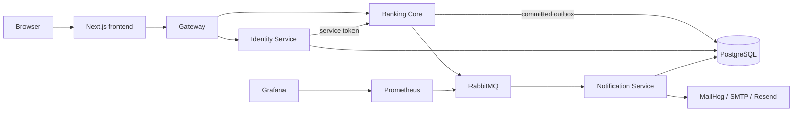

# Security baseline — current implementation

Status: Phase 00 baseline; no security behavior changed

Observed: 2026-09-11

Scope: source and local Docker Compose inspection of the current `main` implementation. Current source code is authoritative where older reports conflict with it.

## Assets

| Asset | Owner | Security property |
| --- | --- | --- |
| Banking customer, account, payment, ledger and outbox records | Banking Core / `public` schema | authorization, integrity, local ACID booking |
| Identity credentials, password-reset hashes and session version | Identity Service / `identity` schema | confidentiality, account recovery integrity |
| Notification inbox/deduplication state | Notification Service / `notification` schema | event idempotency |
| JWT and service/broker/database credentials | Runtime environment | confidentiality, rotation, least privilege |
| Payment notification events | Banking outbox / RabbitMQ | integrity, replay/duplicate safety, data minimization |
| Browser session cookie | Browser and Identity Service | HttpOnly, SameSite, expiry and secure transport |
| Observability data | Prometheus, Grafana, Jaeger and structured logs | availability; no secrets or unnecessary PII |

## Actors and entry points

| Actor | Entry points | Trust level |
| --- | --- | --- |
| Anonymous browser | Next.js, Gateway identity routes | untrusted |
| Authenticated customer | Gateway Banking routes and SSE | authenticated, owner-scoped |
| Administrator | Gateway `/admin/*` routes | authenticated, server-side role checked |
| Identity Service | Banking `/internal/customers/provision` | service token required |
| Banking Core | Notification private HTTP command; RabbitMQ publisher | service-to-service credential |
| Notification Service | RabbitMQ payment events, SMTP/Resend | consumer/provider boundary |
| Local developer/operator | Compose ports, MailHog, RabbitMQ Management, Grafana, Jaeger, Prometheus | privileged local development boundary |

## Current service and trust boundaries

- Banking, Identity and Notification use separate runtime PostgreSQL roles. Migration `000015` and the role provisioner enforce `public`, `identity`, and `notification` schema boundaries.
- Account, Payment and Ledger remain one Banking Core consistency boundary. Bookings use serializable transactions, deterministic locks, double-entry posting and transactional outbox insertion.
- Gateway forwards public identity paths to Identity and all other paths to Banking. It removes the Banking provisioning header from forwarded browser requests.
- Password reset is a synchronous Identity-to-Notification command with a bearer token; payment activity is asynchronous through RabbitMQ.

## Authentication, authorization and message controls observed

| Area | Existing control | Classification |
| --- | --- | --- |
| Browser session | 15-minute HS256 JWT, issuer/audience, `jti`, HttpOnly and SameSite=Strict cookie | ALREADY FIXED baseline control |
| Session state | Banking validates authenticated customer existence; session version is carried and reset flows revoke sessions | ALREADY FIXED baseline control |
| CSRF | Banking middleware checks custom header, Fetch Metadata and origin for cookie-authenticated unsafe requests | ALREADY FIXED for Banking routes |
| CORS | Banking uses explicit configured origins with credentials | ALREADY FIXED for Banking routes |
| Authorization | Owner-scoped handler/service/query controls and server-side admin checks | ALREADY FIXED baseline control; Phase 07 needs full matrix verification |
| SQL injection | sqlc/parameterized PostgreSQL queries and no user-input SQL concatenation found in reviewed paths | ALREADY FIXED baseline control |
| Request parsing | Banking strict JSON decoder rejects unknown fields and multiple documents; global 1 MiB body limit | ALREADY FIXED for Banking routes |
| Identity parsing | Identity decoder rejects unknown fields, multiple JSON documents and body over 64 KiB | ALREADY FIXED baseline control |
| Notification command | constant-time bearer comparison, JSON media type, strict JSON and 64 KiB body limit | ALREADY FIXED baseline control |
| Messaging | versioned envelope validation, publisher confirms, durable queues, retry/DLQ, Notification event-ID claims | ALREADY FIXED baseline control |
| Browser XSS | React text rendering, Next CSP nonce/proxy, restrictive API headers; no reviewed raw HTML sink | ALREADY FIXED baseline control; Phase 04 must exhaustively verify |
| Observability | request/correlation IDs, Jaeger, broker Prometheus metrics and Grafana | ALREADY FIXED baseline control; security-event detection remains future work |

## Frontend input surface inventory (baseline level)

The current frontend is centred on `BankingApp.tsx` and `TransferWizard.tsx`, with authentication and reset pages. Observed user-controlled fields include registration/login/reset credentials, profile details, account names, transfer/payment beneficiary details, amount, IBAN/BIC, purpose, creditor reference, schedule dates, standing-order frequency/count, admin role/status/amount, transaction filtering, and beneficiary inputs.

Input controls are uneven: profile fields and several payment fields have HTML `maxLength`/type hints, while client validation is not yet documented as a complete contract. React-side checks are UX only; Banking and Identity HTTP handlers remain the security boundary. Phase 01 will define field-level authoritative contracts before any broad validator refactor.

## Public, internal and operational interfaces

| Interface | Current exposure | Notes |
| --- | --- | --- |
| Frontend | host port `3000` | intended browser interface |
| Gateway | host port `${BACKEND_PORT:-8383}` | intended public API edge |
| Banking API | Compose-internal only | public-like routes still exist in its process; intended path is Gateway |
| Identity Service | Compose-internal only | intended path is Gateway |
| Notification Service | host port `${NOTIFICATION_HTTP_PORT:-8490}` | private command endpoint is token protected, but host-published in development Compose |
| PostgreSQL | host port `${DB_PORT:-5433}` | development convenience, administrative database boundary |
| RabbitMQ and Management UI | host ports `5672` and `15672` | development convenience; broker credentials required |
| MailHog, Jaeger, Prometheus, Grafana | host ports | local operational/development tools |

## Known gaps and findings

| ID | Classification | Evidence | Impact / recommended phase |
| --- | --- | --- | --- |
| SB-01 | HARDENING | `docker-compose.yml` publishes PostgreSQL, RabbitMQ protocol/Management UI, Notification, MailHog, Jaeger, Prometheus and Grafana to all host interfaces. | Local development convenience increases the host attack surface. Decide localhost bindings/internal networks and production profile in Phase 18. |
| SB-02 | HARDENING | Gateway routes `/login` to Identity. Identity's route handler validates JSON structurally, but does not enforce `Content-Type: application/json` like Banking's global `RequireJSON` middleware. Existing smoke test expected `415` and received `400`. | No demonstrated authentication bypass; make media-type behavior explicit and consistently tested in Phase 03/06. |
| SB-03 | HARDENING | `security-smoke.ps1` reads errors through the Windows PowerShell response API. Under PowerShell 7, the caught response type lacks `GetResponseStream`; under Windows PowerShell it continues but reveals the SB-02 expectation mismatch. | Regression coverage is not portable. Repair the harness in Phase 23 without weakening assertions. |
| SB-04 | PROBABLE — NEEDS VERIFICATION | Banking Core retains legacy public authentication route registration in `cmd/main.go`, while Gateway normally routes those paths to Identity. Direct Banking host publication is absent from the main Compose file. | Verify all deployment profiles/network paths before calling this reachable. Address duplicate auth reachability in Phase 05/11 if confirmed. |
| SB-05 | HARDENING | IP limiting is process-local and optionally trusts forwarded headers when `RENDER`/`TRUST_PROXY_HEADERS` is set. | Distributed abuse resistance and proxy trust need deployment-aware design in Phase 10. |
| SB-06 | NOT APPLICABLE | No file upload endpoint was found. | Preserve this assessment; a future upload feature requires a separate threat model. |
| SB-07 | ALREADY FIXED | Phase 8 runtime role grants and tests deny cross-schema runtime access. | Revalidate least privilege and external DB/TLS posture in Phase 14. |

## Critical security invariants to preserve

1. A booked financial movement creates balanced debit and credit entries and never modifies existing entries.
2. Funds checks, deterministic account locking, payment state change, cached balances and outbox event insertion remain one serializable Banking transaction.
3. Same payment idempotency key plus same intent replays safely; changed intent conflicts; duplicate events cannot produce a second normal delivery.
4. Customers cannot read or mutate another customer's account, payment, transaction, profile or beneficiary data; system accounts are not customer-operable.
5. Service data access stays schema-local and cross-service business data crosses explicit HTTP/event contracts only.
6. Password reset uses high-entropy, hashed, expiring and single-use tokens and invalidates prior sessions after consumption.
7. Authentication credentials, cookies, JWTs, service tokens and provider secrets never enter client responses, events or logs.

## Baseline validation

| Check | Result | Evidence |
| --- | --- | --- |
| Compose health | PASS | All active application, data, broker and observability services were healthy during inspection. |
| Security smoke under PowerShell 7 | BLOCKED | Harness response-body compatibility error before assertions complete (SB-03). |
| Security smoke under Windows PowerShell | FAIL (expected baseline mismatch) | `Content-Type enforcement` expected `415`, received `400` from Gateway-routed Identity login (SB-02). |
| Existing source-level security tests | NOT RE-RUN in this documentation-only phase | No production behavior changed; subsequent implementation phases must run their relevant quality gates. |

## Phase 00 conclusion

This baseline does not certify production banking security. It records the current controls, concrete development-exposure and regression-harness gaps, and the invariants that later phases must not weaken. Findings are intentionally classified by evidence; no scanner output or historic report is treated as proof without current-code verification.
